# Release films

For a release tag, this skill records a narrated demo film of the release's user-facing changes, filmed in the
product through its own end-to-end tests, and builds a page with the film, its chapters and every pull request of
the release.

## Demo

[](https://selleo.github.io/mentingo/v4.15.0/)

The film of Mentingo v4.15.0 (4 minutes, 8 chapters), recorded in GitHub Actions: [watch it with its chapters and
the release's pull requests](https://selleo.github.io/mentingo/v4.15.0/). Every film:
https://selleo.github.io/mentingo/.

## Why

A release often bundles dozens of pull requests. Turning them into a demo by hand takes a QA or marketing specialist
about two hours (their estimate). A film from the release tag shows every user-facing change a scene could film,
and its page says why each other change is left out.

## What a run makes

- A film: MP4, 1080p, narrated in the project's language (English or Polish), with a bar under the picture that says
  what happens (it reads without sound) and the narration as subtitles.
- A page: the film, its chapters (each one a jump into the film) and every pull request of the release, with the
  chapter that shows it or the reason it is not in the film.
- In GitHub Actions, the film and its page as the run's artifacts; published on request to the release (its assets
  and a section of links in its notes) and to the project's GitHub Pages site of films.

## How it works

```mermaid
flowchart LR
  tag[Release tag] --> prs[Pull requests since the previous release]
  prs --> pick[Changes a user can see]
  pick --> scene[One scene per change, built on an existing E2E test]
  scene --> take[Scenes filmed on the project's E2E stack]
  take --> words[Narration pinned to the filmed actions]
  words --> review[Every sentence checked against the frames]
  review --> film[Voice, captions, cut and render]
  film --> page[Film and page: release or Pages]
```



- Claude Opus 5.5 picks the changes a user can see. For each, a Claude Code worker writes a short Playwright scene
  from an existing E2E spec and films it on the project's own E2E stack, with the project's test data.
- The narration is pinned to the filmed actions. A review checks every sentence against the frames the film shows and
  rewrites or drops what the picture does not prove.
- Scripts do the rest: Microsoft's edge-tts voice, the cut of each take to its narration, the captions, FFmpeg's
  render and the page.
- What a run learns about the project (logins, test data, locators) is kept for the next run.

## Run it

On a machine: Docker, the project's Node, FFmpeg (with drawtext, libx264 and libmp3lame), Git, a signed-in `gh` and
the Claude Code CLI signed in with a Claude subscription. The machine check lists what is missing and how to install
it:

```bash
python3 .agents/skills/release-film/scripts/film.py doctor --repo <owner>/<name>
python3 .agents/skills/release-film/scripts/film.py run --repo <owner>/<name> --tag <tag>
```

A project needs its recipe in `projects/<owner>__<name>.json`: how to install it, which services its tests need and
which Playwright config runs them. [SKILL.md](SKILL.md) describes it.

In GitHub Actions, both workflows start only by hand:

- `release-film.yml` records the film of a tag on a Claude for Teams token (`CLAUDE_CODE_OAUTH_TOKEN` from
  `claude setup-token`, kept in the `release-film` environment, whose branch rule names the branches that may use
  it). Its `publish` input is off by default.
- `release-film-publish.yml` publishes a recording (its run ID) to a test draft release, to the tag's release or to
  the Pages site alone. It never replaces or deletes an asset, and the site keeps every film it already shows.

## Measured

Three recordings in GitHub Actions on two projects, September 2026:

| | |
| --- | --- |
| Time | 17–31 min in all, the film 16–19 min of it (the rest installs the tools and builds a project's E2E images where it has them) |
| Claude for Teams seat | 25–35 points of the 5-hour limit, 3 points of the weekly one |
| Model calls at API list prices | $7–10 a film (for sizing only: the subscription pays) |

## Safety

- Scenes run on an isolated copy of the application with test data, never on a live system. They create data only
  through the project's helpers, factories, fixtures or UI; a scene with its own database client or SQL is refused.
- Scene workers read files, edit only their scene's folder and run only the film's commands. Their own tools cannot
  read the process environment, the Claude Code login or a checkout's Git credentials; the test code a scene runs
  could, so the CI's secrets are replaced with `***` in the run's files before anything is uploaded.
- In CI the Claude token is set only on the steps that call Claude and on the one that hides it. In a public
  repository the run's artifacts (the film, its report and the project knowledge) and its job summary can be read by
  anyone signed in to GitHub.
- A person watches the film before it is published: a recording publishes nothing unless asked to.

## Limits

- Features that depend on outside services (payments, AI providers, video calls) cannot be shown with test data; the
  page lists them with the reason.
- Changes a user cannot see (refactoring, dependencies, CI) are listed, not filmed.
- The films show stakeholders and clients what changed. A synthetic voice and automatic editing do not replace a
  produced promotional video.
- The project needs end-to-end tests that start the application with test data.

## Files

| Path | What it holds |
| --- | --- |
| [SKILL.md](SKILL.md) | The skill's instructions for the agent that runs it |
| `scripts/` | `film.py` and the steps of a run: sources, scenes, narration, review, voice, montage, render, page |
| `scripts/capture/` | The Playwright camera that films a scene's test |
| `ci/` | The helpers the workflows run: tools, secret redaction, the job summary, release assets and the Pages site |
| `projects/` | Each project's recipe and the pronunciation shared by all projects |
| `tests/` | The skill's tests |
