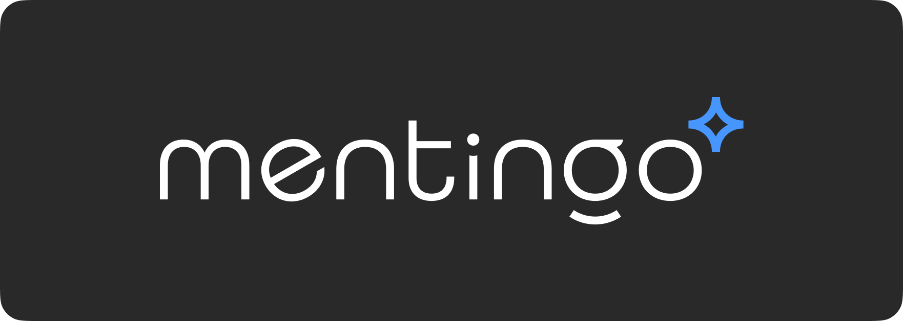
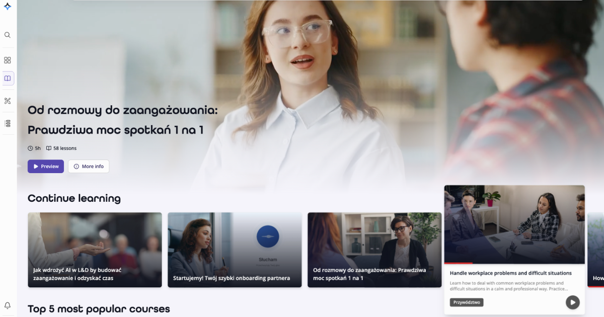
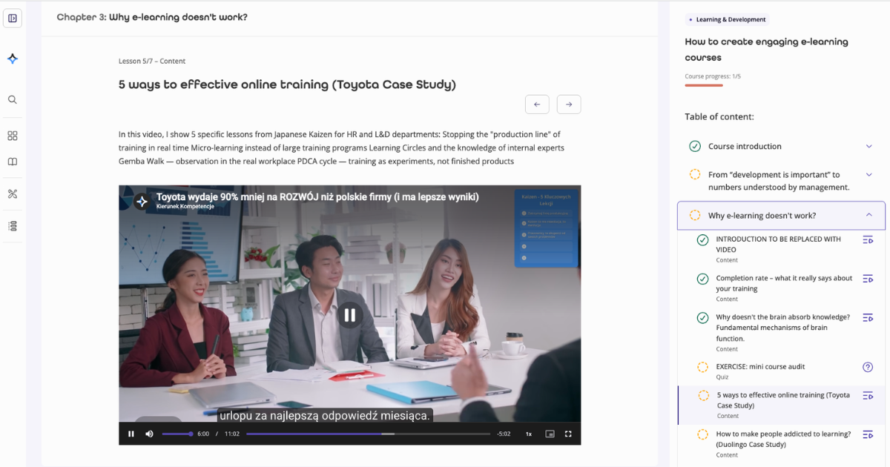
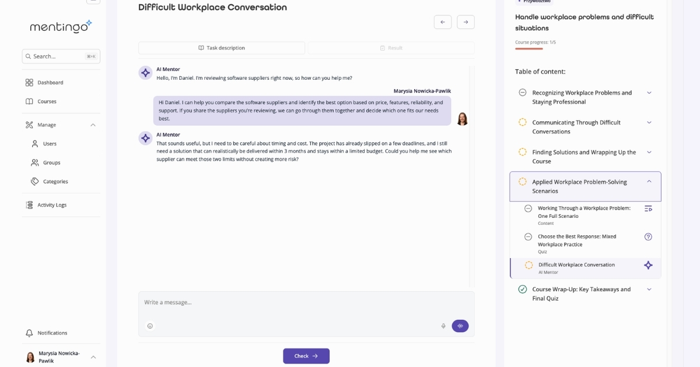
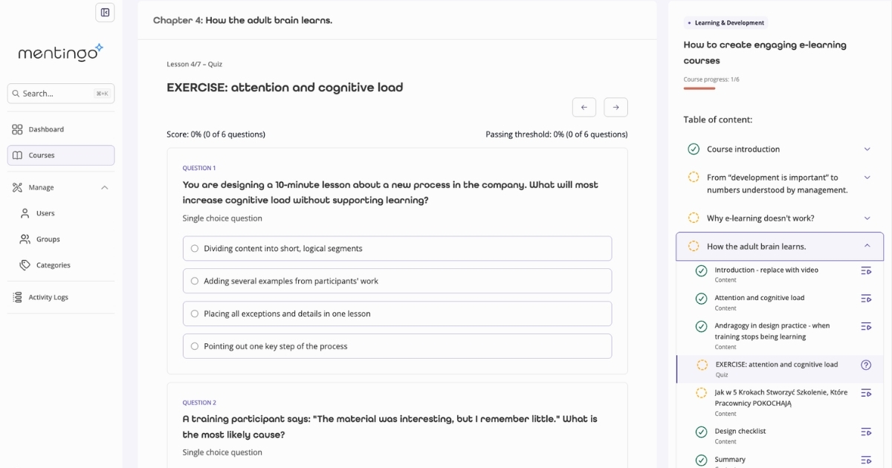
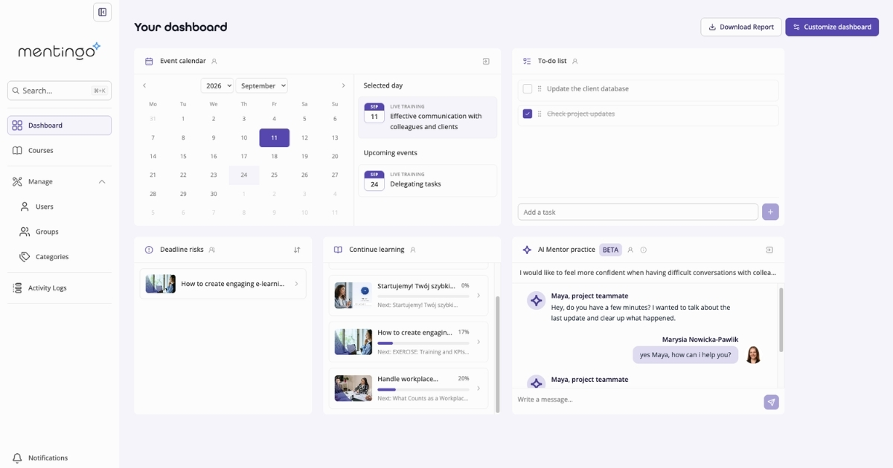
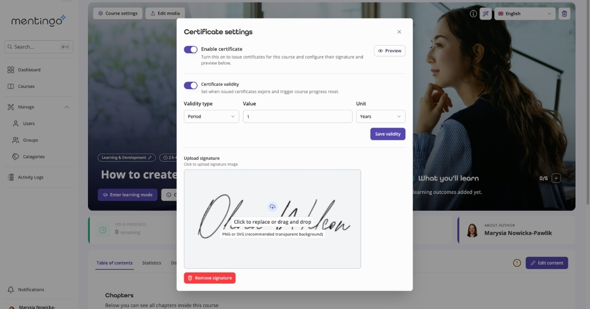

<div align="center">
  
</div>

<h1 align="center">Mentingo - open-source AI-mentor LMS for enterprise L&amp;D</h1>

<p align="center">
  <strong>Mentingo is an open-source, self-hosted learning management system (LMS) with a built-in AI mentor</strong>, built for corporate L&amp;D, employee onboarding and compliance training.<br/>
  MIT-licensed, white-label and multi-tenant - run it on your own infrastructure, brand it as your own, and keep every learner record inside your organisation.
</p>

<p align="center">
  <a href="https://github.com/Selleo/mentingo/blob/main/LICENSE"></a>
  <a href="https://github.com/Selleo/mentingo/releases"></a>
  <a href="https://github.com/Selleo/mentingo/stargazers"></a>
  <a href="https://github.com/Selleo/mentingo/actions"></a>
  
  
  <a href="https://github.com/Selleo/mentingo/discussions"></a>
  <a href="https://aws.amazon.com/marketplace/pp/prodview-dgkpxqyvmyxbw"></a>
</p>

<p align="center">
  <a href="https://demo.mentingo.com"><strong>Live demo</strong></a> ·
  <a href="#quick-start">Quick start</a> ·
  <a href="#deploy-on-aws">Deploy on AWS</a> ·
  <a href="#features">Features</a> ·
  <a href="#security--compliance">Security &amp; compliance</a> ·
  <a href="#faq">FAQ</a> ·
  <a href="docs/">Docs</a> ·
  <a href="#commercial-support">Commercial support</a>
</p>

<!-- ETAP 4: podmienić na realny link do sandboxa. Do tego czasu badge/link może prowadzić do mentingo.com/demo -->

---

## Screenshots

|  |  |
|---|---|
|  <br/> **Course catalog** - continue learning, top courses, one click in |  <br/> **Lesson view** - distraction-free content with video |
|  <br/> **AI Mentor** - real-time role-play, scored automatically |  <br/> **Assessment engine** - scenario-based questions, not just recall |
|  <br/> **Admin dashboard** - deadlines, to-do list, AI mentor practice |  <br/> **Recertification** - expiring certificates, signature and validity period |

<!-- ETAP 4: dodać 30-sekundowy GIF z tour po nagraniu, np. > 30-second product tour: [docs/assets/mentingo-tour.gif](docs/assets/mentingo-tour.gif) -->

---

## Who is it for

**Enterprise L&D and HR teams** running onboarding, product and mandatory training for hundreds or thousands of employees, who need one platform instead of ten tools - and who need to prove, on demand, who was trained and when.

**Compliance, security and risk owners** who have to deliver recurring, evidenced training (cyber security, safety, regulatory) and need learner data to stay in a jurisdiction and an infrastructure they control.

**Product and engineering teams** building an EdTech or HRTech product, or embedding training into an existing platform. MIT licence, typed OpenAPI client, multi-tenancy and white-labelling are in the box - no per-seat licence to resell around.

---

## Quick start

Runs locally on macOS, Linux or Windows. Full guide: [docs/development-setup.md](docs/development-setup.md). Environment variable reference: [docs/configuration.md](docs/configuration.md).

**Prerequisites:** Node.js >= 22.15 (see `.tool-versions`), pnpm 10, Docker + Docker Compose, [Caddy](https://caddyserver.com/) 2.8.4.

```bash
git clone https://github.com/Selleo/mentingo.git
cd mentingo
pnpm setup:unix    # Windows: pnpm setup:win
pnpm dev
```

`setup` verifies tooling, configures HTTPS via Caddy, installs dependencies, writes `.env` files, starts the Docker services (PostgreSQL + pgvector, Redis, MinIO, Mailhog), runs migrations and seeds a three-tenant demo environment.

Then open **https://tenant1.lms.localhost** and sign in:

| Role | Email | Password |
|---|---|---|
| Admin | `admin+tenant1@example.com` | `password` |
| Content creator | `contentcreator+tenant1@example.com` | `password` |
| Learner | `student+tenant1@example.com` | `password` |

API and Swagger docs: `https://tenant1.lms.localhost/api` · Mail catcher: `https://mailbox.lms.localhost`

Deploying to a server: [docs/deployment.md](docs/deployment.md) (worked example on Hetzner Cloud + AWS Route 53/ECR).

### Deploy on AWS

Do not want to build anything? Mentingo is listed on the [AWS Marketplace](https://aws.amazon.com/marketplace/pp/prodview-dgkpxqyvmyxbw) as a container image with a CloudFormation template that provisions ECS, RDS and ElastiCache for you.

- **No software charge.** The listing is free with no end date - you pay only for the AWS resources the stack creates.
- **Runs in your own AWS account**, in the region you choose. Learner data never leaves it.
- Subscribe, launch the stack, point a domain at it.

<!-- ETAP 5: listing na Marketplace stoi na v4.9.0, repo jest na v4.18.0 - zaktualizować obraz kontenera przed promowaniem tego linku -->

---

## At a glance

| | |
|---|---|
| **Licence** | MIT - modify, white-label and resell, no copyleft obligation |
| **Hosting** | Self-hosted on your own infrastructure, one-click CloudFormation deployment from [AWS Marketplace](https://aws.amazon.com/marketplace/pp/prodview-dgkpxqyvmyxbw), or managed by [Selleo](https://selleo.com/lms-software-development) |
| **Cost model** | Self-hosted: no licence fee, you pay only for infrastructure. Managed: flat tiered subscription, not per-seat metering |
| **Backend** | NestJS 10 · TypeScript · Drizzle ORM · PostgreSQL 16 + pgvector · Redis · BullMQ · Socket.IO |
| **Frontend** | Remix (Vite SPA) · React · Radix UI · TanStack Query/Table · Recharts |
| **AI** | Vercel AI SDK + OpenAI · LangChain · pgvector retrieval · LiveKit real-time voice · Langfuse tracing |
| **Authentication** | Microsoft 365, Google Workspace and Slack OAuth 2.0 SSO · email/password · TOTP two-factor |
| **Multi-tenancy** | PostgreSQL Row-Level Security with a least-privilege runtime role, per-tenant domains |
| **Interoperability** | SCORM 1.2 export · OpenAPI/Swagger with a generated typed client · CSV and XLSX bulk import/export |
| **Storage & media** | Any S3-compatible object storage (MinIO, AWS S3, Hetzner) · Bunny Stream video with signed URLs |
| **Payments** | Stripe (optional - for selling courses) |
| **UI languages** | English, Polish, German, Spanish, French, Czech |
| **Runtime** | Node.js >= 22.15, pnpm 10 |
| **Latest release** | see [CHANGELOG.md](CHANGELOG.md) and [Releases](https://github.com/Selleo/mentingo/releases) |

---

## Features

### AI-powered training

- **Practise conversations instead of watching slides.** A voice and chat AI mentor runs real-time role-play for sales, compliance and customer-support scenarios, and scores the attempt automatically.
- **Turn the documents you already have into a course.** The AI course architect converts knowledge bases, policies and internal documentation into structured, interactive courses in minutes.
- **Grade open-ended answers without an L&D queue.** Behavioural and problem-solving tasks are analysed automatically and returned with actionable feedback.
- **Keep the AI accountable.** Every model call is traced with Langfuse, so you can inspect cost, latency and what the mentor actually said.

### Enterprise and white-label readiness

- **Ship it as your own product.** Custom domains, logos, colours and styles - no Mentingo branding required anywhere in the learner experience.
- **One deployment, many organisations.** Multi-tenancy is enforced in PostgreSQL with Row-Level Security, not only in application code - fit for holding structures, group companies and B2B training vendors.
- **Turn infrastructure on without a developer.** A central admin hub enables corporate SSO (Microsoft 365, Google Workspace, Slack) and your AI provider key from the UI.

### Corporate L&D and engagement

- **Mirror the org chart you actually have.** Departments, branches and teams as groups, with course access inherited automatically.
- **Mandatory training that renews itself.** Set expiry intervals for compliance, safety or cyber-security courses; re-enrolment and reminder schedules run on their own.
- **An interface people open voluntarily.** A clean, consumer-grade UI built for completion rates, not for admin convenience.
- **Assess more than recall.** Behavioural scenarios, short and long-form text analysis, dynamic quizzes and daily streaks.
- **See what training is doing.** Engagement, consistency and outcome analytics per learner, group and course.

### Knowledge management and internal comms

- **One place for the material that is not a course.** Central repository for documentation, playbooks and assets.
- **Keep hybrid teams aligned.** Built-in company blog, announcements and an internal FAQ.

---

## How Mentingo compares

|  | **Mentingo** | Moodle | Open edX | Docebo | TalentLMS |
|---|---|---|---|---|---|
| Licence | **MIT** - permissive | GPL v3 - copyleft | AGPL v3 - network copyleft | Proprietary | Proprietary |
| Self-hosting | Yes | Yes | Yes | No | No |
| One-click cloud deployment | Yes - AWS Marketplace (CloudFormation: ECS, RDS, ElastiCache), no software charge | Partner hosting | Third-party providers | Vendor SaaS only | Vendor SaaS only |
| White-label and resell | Yes, no obligation to publish your changes | Yes, derivatives stay GPL | Yes, but a hosted fork must disclose source | Branding only, per plan | Branding only, per plan |
| Cost model | Self-host: infrastructure only. Managed: flat tiers | Free licence, paid hosting/partners | Free licence, significant DevOps cost | Per-user subscription | Per-user subscription |
| Built-in AI mentor (voice + chat role-play) | Yes | Via third-party plugins | Via extensions | Yes, vendor-controlled | Limited |
| AI provider | Bring your own key | n/a | n/a | Vendor-controlled | Vendor-controlled |
| Multi-tenancy | Yes - PostgreSQL Row-Level Security | Separate instances or plugins | Yes, operationally complex | Vendor-managed | Vendor-managed |
| Corporate SSO | Microsoft 365, Google Workspace, Slack | Plugins | Yes | Yes | Yes |
| Stack | TypeScript (NestJS + React/Remix) | PHP | Python/Django | n/a | n/a |
| Time to a running instance | One setup script locally, or a CloudFormation stack from AWS Marketplace | Moderate | High (Tutor + DevOps) | n/a | n/a |

Licences verified from each project's `LICENSE` file in September 2026. Commercial pricing and feature tiers change - check the vendors' current pricing pages before making a decision.

**Choose Mentingo if** you want a modern, AI-first LMS you can host yourself, brand as your own and extend in TypeScript, without a per-seat licence and without a copyleft obligation.

**Choose something else if** you need a decades-old plugin ecosystem for academic teaching (Moodle), MOOC-scale public course delivery (Open edX), or a fully managed enterprise suite and you are comfortable with per-user pricing (Docebo, TalentLMS).

---

## Architecture

Component diagram, multi-tenancy model and how the AI mentor pipeline fits together: [docs/architecture.md](docs/architecture.md). Environment variable reference: [docs/configuration.md](docs/configuration.md).

<!-- ETAP 3: diagram (Mermaid) - web/API/worker, Postgres+pgvector, Redis, S3, provider AI, LiveKit -->

**Apps**

| App | What it is |
|---|---|
| `apps/api` | NestJS API - domain logic, auth, AI orchestration, background jobs (BullMQ), WebSockets |
| `apps/web` | Remix single-page app (Vite) - learner, content-creator and admin interfaces |
| `apps/reverse-proxy` | Caddy config providing local domains and HTTPS in development |

**Packages**

| Package | What it is |
|---|---|
| `@repo/shared` | Types and helpers shared by API and web |
| `@repo/prompts` | Versioned AI prompt sources and generation |
| `@repo/scorm-export-generator` | Node-side SCORM 1.2 export package generator |
| `@repo/scorm-export-runtime` | Standalone browser runtime for exported SCORM packages |
| `@repo/email-templates` | Transactional email templates |
| `@mentingo/performance-tests` | k6 suite - load, stress, spike, soak and mixed scenarios |
| `@repo/eslint-config`, `@repo/typescript-config` | Shared tooling configuration |

**What it costs to run**

<!-- ETAP 3 (DevOps): podać realny footprint zmierzony k6, np. "500 aktywnych użytkowników = 4 vCPU / 8 GB RAM / 50 GB SSD, ~40 EUR/mies. na Hetznerze".
     To jest liczba, której nie podaje żaden konkurencyjny projekt open source - warto ją mieć. -->

The repository ships a k6 performance suite (`pnpm perf:load`, `perf:stress`, `perf:spike`, `perf:soak`) so you can size your own deployment before committing to it.

---

## Security & compliance

Mentingo is built for training that has to be evidenced to an auditor, not only delivered.

**Tenant and data isolation**

- Multi-tenancy enforced at the database level with PostgreSQL Row-Level Security.
- The application connects with a least-privilege runtime role; schema migrations use a separate administrative role.
- Each tenant is served on its own origin, with CORS restricted per tenant.

**Authentication and access**

- Corporate SSO over OAuth 2.0: Microsoft 365 (incl. Microsoft Graph), Google Workspace, Slack.
- Email and password with bcrypt hashing, JWT access and refresh tokens.
- Time-based one-time password (TOTP) two-factor authentication.
- Role-based access: admin, content creator, learner; group-based course access inheritance.
- API rate limiting and request throttling.

**Data handling**

- Self-hosted: learner data stays in your database, your object storage and your region. You choose the cloud and the jurisdiction - an EU-only deployment is a configuration choice, not a paid tier.
- Files are served through pre-signed, expiring URLs; video through Bunny Stream signed tokens.
- An application master key is required to run the platform and is used to protect sensitive stored values.
- **AI: bring your own key.** You configure the AI provider and its API key. No prompt or learner content is routed through Selleo infrastructure in a self-hosted deployment.

**Evidence and observability**

- Recurring recertification with expiry dates, automated re-enrolment and notification schedules.
- Per-learner completion and engagement records, exportable to CSV/XLSX.
- Application monitoring with Sentry and OpenTelemetry; every AI call traced in Langfuse.

**Interoperability**

- SCORM 1.2 export, so content authored in Mentingo can be handed to another LMS - and so your organisation is not locked in.

<!-- ETAP 3 - do potwierdzenia przez zespół, NIE publikować bez weryfikacji:
     ISO 27001 (certyfikat Selleo czy tylko zgodność procesów?), WCAG 2.1 AA (audyt dostępności),
     wzór DPA/RODO, pentest, xAPI/LTI, mapowanie na NIS-2 / art. 8e KSC, retencja i usuwanie danych. -->

Found a vulnerability? Please read [SECURITY.md](SECURITY.md) - do not open a public issue.

---

## Extending and integrating

- **Typed API client.** The API is documented with OpenAPI/Swagger at `/api`; `pnpm generate:client` regenerates the typed client used by the web app - and by anything else you build.
- **Bulk operations.** Import and export users and results as CSV or XLSX.
- **Integration origins.** A dedicated CORS allow-list (`INTEGRATION_CORS_ORIGINS`) for embedding Mentingo endpoints in your own products.
- **Your own AI provider.** Model and key are configuration, not a fork.
- **White-label.** Domains, logo, colours and styles per tenant.
- **Localisation.** Six UI languages shipped; translations live in `apps/web/app/locales/<lang>/translation.json` - adding one is a pull request, not a licence upgrade.

Contributions welcome - see [CONTRIBUTING.md](CONTRIBUTING.md) and the [Discussions](https://github.com/Selleo/mentingo/discussions) board.

---

## FAQ

### What is Mentingo?

Mentingo is an open-source, self-hosted learning management system (LMS) with a built-in AI mentor. It is built for corporate learning and development - employee onboarding, product and sales enablement, and mandatory compliance training - rather than for academic course delivery.

### Is Mentingo really free?

The software is free under the MIT licence. You can run it, modify it, rebrand it and even resell it without paying a licence fee. What you pay for is the infrastructure you run it on, and optionally a managed hosting or implementation contract with Selleo.

### Can I self-host Mentingo?

Yes - self-hosting is the default. You need Node.js 22, PostgreSQL 16 with the pgvector extension, Redis and any S3-compatible object storage. [docs/deployment.md](docs/deployment.md) walks through a production deployment on Hetzner Cloud with AWS for DNS and container registry, but nothing ties the platform to those providers.

### Can I run Mentingo without setting up servers myself?

Yes, in two ways. Mentingo is listed on the [AWS Marketplace](https://aws.amazon.com/marketplace/pp/prodview-dgkpxqyvmyxbw) as a container image with a CloudFormation template that provisions ECS, RDS and ElastiCache in your own AWS account - the listing itself is free of charge, you pay only for the AWS resources, and it lands on your existing AWS bill instead of going through a new vendor procurement cycle. Alternatively, Selleo will host and operate Mentingo for you on a flat tiered subscription.

### How is Mentingo different from Moodle?

Moodle is a mature, plugin-driven platform designed for education, licensed under GPL v3 and written in PHP. Mentingo is a TypeScript platform designed for corporate L&D, licensed under MIT, with an AI mentor, multi-tenancy and white-labelling in the core rather than in plugins. If you need a large academic plugin ecosystem, choose Moodle. If you need a modern, brandable corporate training platform you can extend yourself, choose Mentingo.

### Is Mentingo a free alternative to Docebo?

It covers the same job - corporate training, compliance and analytics with AI support - without a per-user subscription and without giving up control of your data. The trade-off is that you operate it yourself, or pay someone to operate it for you. Docebo is a managed suite with a longer feature list and a matching bill.

### Does Mentingo support SCORM?

Mentingo can export courses as SCORM 1.2 packages, so content you build here can be handed to another LMS. <!-- TODO(weryfikacja): czy jest import SCORM? jeśli tak, dopisać zdanie. jeśli nie - zostaw jak jest -->

### Which AI provider does Mentingo use, and where does my data go?

You configure the provider and supply your own API key - OpenAI is supported out of the box through the Vercel AI SDK. In a self-hosted deployment, prompts and learner content go from your server to the provider you chose and nowhere else; nothing is routed through Selleo. Every model call is traced locally with Langfuse, so you can audit what the mentor said, what it cost and how long it took.

### Can I use Mentingo for compliance and mandatory training?

Yes. Courses can be given expiry intervals with automated re-enrolment and reminder schedules, completion records are kept per learner and exportable, and each tenant's data is isolated at the database level with PostgreSQL Row-Level Security. Whether that satisfies a specific regulation is a question for your compliance team and your deployment, not for the software alone.

### Does Mentingo support single sign-on?

Yes - OAuth 2.0 with Microsoft 365, Google Workspace and Slack, plus email and password with TOTP two-factor authentication.

### Can one installation serve several companies or brands?

Yes. Multi-tenancy is built in and enforced in PostgreSQL with Row-Level Security, with per-tenant domains and branding. This is what makes Mentingo usable by holding structures, group companies and B2B training vendors.

### How much does it cost to run?

<!-- ETAP 3, decyzja 6: wstawić realny footprint zmierzony pakietem k6, np.:
"A 500-active-user deployment fits comfortably on a 4 vCPU / 8 GB server with 50 GB of storage - around EUR 40 per month on Hetzner, plus object storage, video CDN and your AI provider usage."
Bez tej liczby zostaw akapit poniżej. -->

That depends on the number of active learners, how much video you serve and how heavily you use AI. The repository ships a k6 performance suite (`pnpm perf:load`, `perf:stress`, `perf:spike`, `perf:soak`) so you can size a deployment against your own numbers before committing to it.

### Can I white-label Mentingo and resell it?

Yes. The MIT licence permits commercial use, modification and redistribution, and does not require you to publish your changes. Domains, logo, colours and styles are configurable per tenant.

### What languages does the interface support?

English, Polish, German, Spanish, French and Czech. Translations live in `apps/web/app/locales/<lang>/translation.json` - adding a language is a pull request.

### Who builds and maintains Mentingo?

[Selleo](https://selleo.com), a product engineering company. Mentingo is a real product with a managed offering, not an abandoned demo repository - see [CHANGELOG.md](CHANGELOG.md) for the release history.

---

## Roadmap and releases

- Shipped changes: [CHANGELOG.md](CHANGELOG.md) · [GitHub Releases](https://github.com/Selleo/mentingo/releases)
- Planned work: [Issues](https://github.com/Selleo/mentingo/issues) <!-- ETAP 5: publiczna roadmapa (GitHub Projects) i link tutaj -->

---

## Commercial support

Mentingo is free to self-host under the MIT licence, and it is maintained by [Selleo](https://selleo.com) - a product engineering team that has been building learning platforms since 2005.

| | |
|---|---|
| **Managed hosting** | We run Mentingo for you - infrastructure, updates, backups, monitoring. Flat tiered pricing, no per-seat metering. [Pricing](https://mentingo.com/pricing) |
| **Go live in 7 days** | Branded, configured and populated production instance in a week, using pre-built modules instead of a months-long implementation project. |
| **Custom build on top** | Integrations with your HRIS, SSO or internal systems; new modules; a full product built on the Mentingo core. |
| **Two-week trial sprint** | Work with our team for two weeks before committing to anything longer. |
| **One-click AWS deployment** | Subscribe on [AWS Marketplace](https://aws.amazon.com/marketplace/pp/prodview-dgkpxqyvmyxbw) and launch a CloudFormation stack - ECS, RDS and ElastiCache - inside your own AWS account. No software charge, no procurement cycle: it goes on your existing AWS bill. |

**[Talk to us →](https://selleo.com/lms-software-development)**

---

## Community and contributing

- [Discussions](https://github.com/Selleo/mentingo/discussions) - questions, ideas, show and tell
- [Issues](https://github.com/Selleo/mentingo/issues) - bugs and feature requests
- [CONTRIBUTING.md](CONTRIBUTING.md) - branch, commit and pull request conventions
- [CODE_OF_CONDUCT.md](CODE_OF_CONDUCT.md)

If Mentingo is useful to you, a ⭐ helps other L&D and engineering teams find it.

## Licence

MIT - see [LICENSE](LICENSE). You may run, modify, white-label and resell Mentingo, including commercially, without a copyleft obligation to publish your changes.

---

<div align="center">
  
  <p>Built and maintained by <a href="https://selleo.com/lms-software-development">Selleo</a>.</p>
</div>
