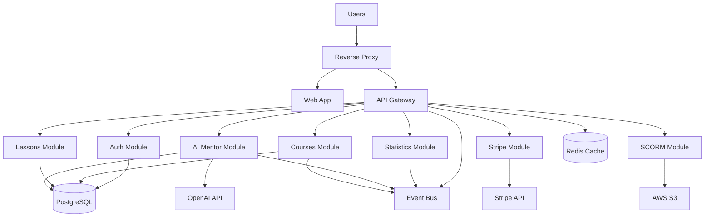
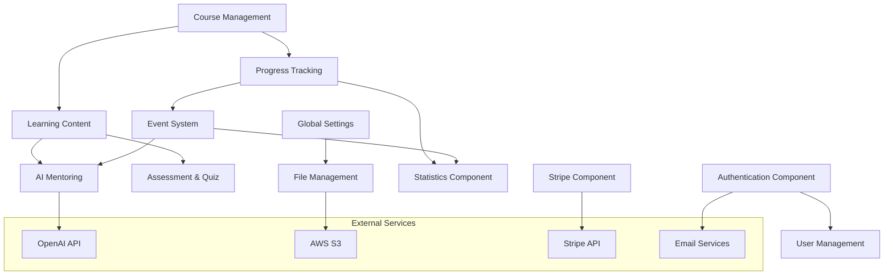
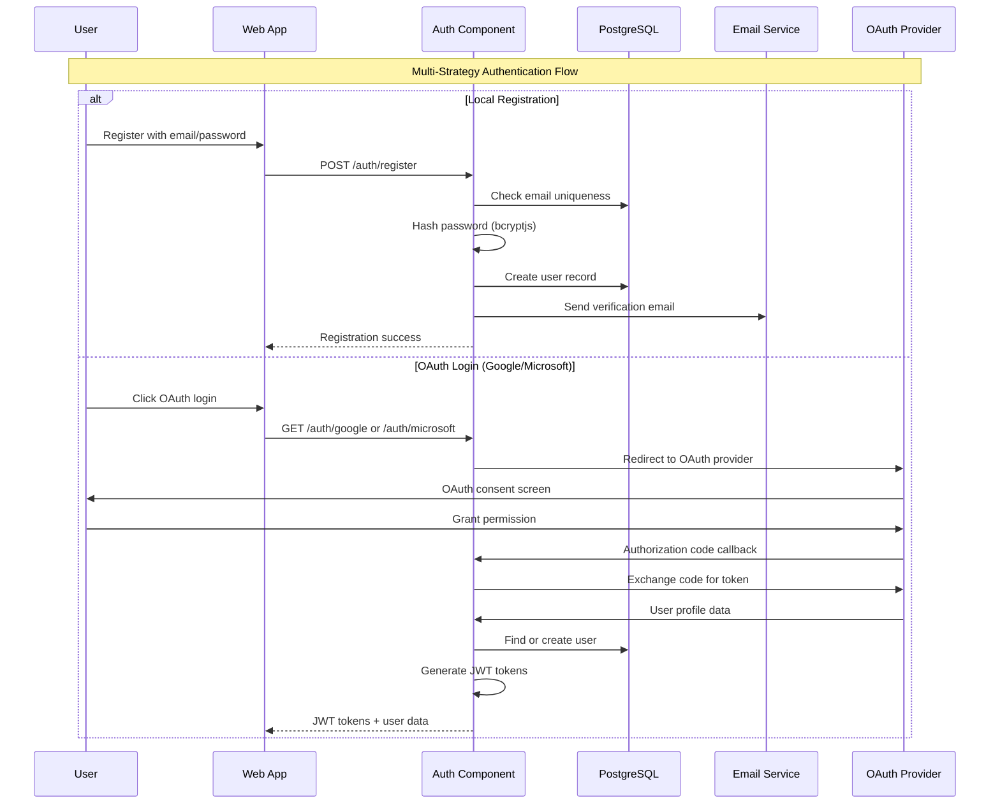
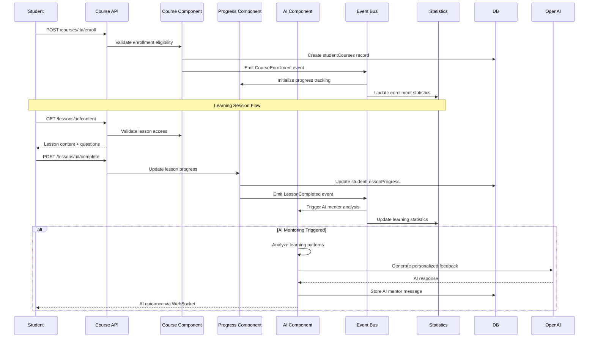
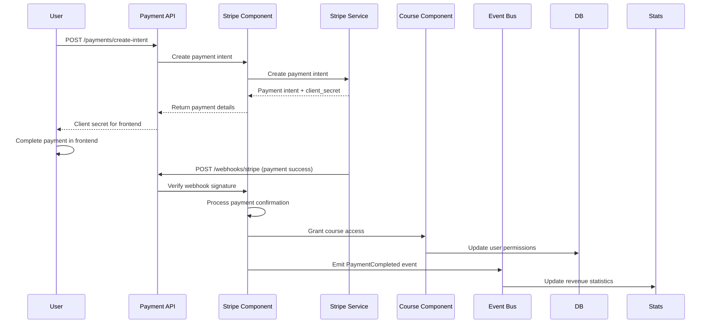
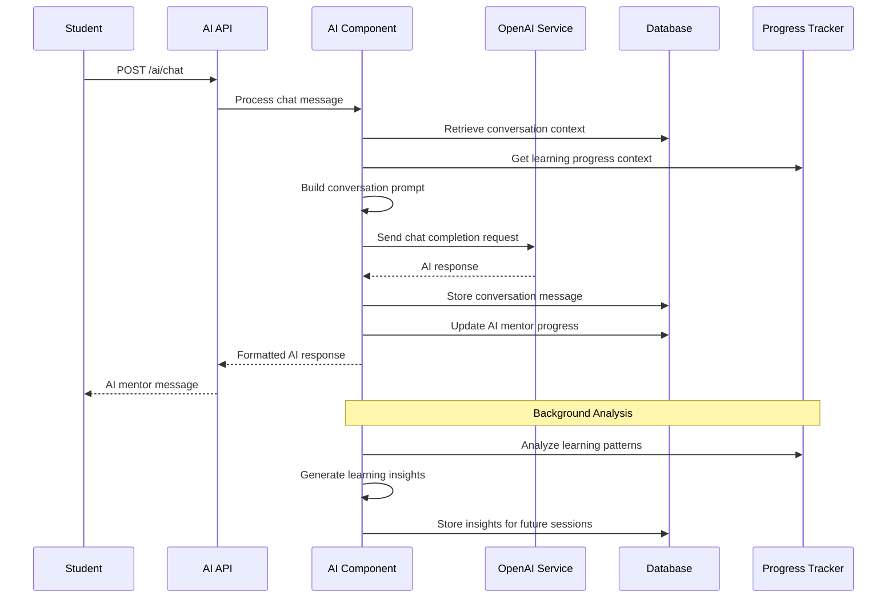

# Mentingo Architecture Document

## Introduction

This document outlines the overall project architecture for Mentingo, including backend systems, shared services, and non-UI specific concerns. Its primary goal is to serve as the guiding architectural blueprint for AI-driven development, ensuring consistency and adherence to chosen patterns and technologies.

**Relationship to Frontend Architecture:**
If the project includes a significant user interface, a separate Frontend Architecture Document will detail the frontend-specific design and MUST be used in conjunction with this document. Core technology stack choices documented herein (see "Tech Stack") are definitive for the entire project, including any frontend components.

### Starter Template or Existing Project

**Existing Project Foundation:**
Mentingo is built on an **existing, mature NestJS foundation** rather than a starter template. Here's what has been identified:

**Framework**: NestJS 10.0.0 with TypeScript 5.4.5
**Architecture**: Well-established domain-driven design with modules
**Database**: Drizzle ORM with PostgreSQL, 28+ migrations showing mature evolution
**Authentication**: Multi-strategy (Local, Google OAuth, Microsoft OAuth, JWT)
**Testing**: Comprehensive Jest setup with E2E and unit test infrastructure
**Monorepo**: Established Turbo monorepo with api/web/reverse-proxy apps

**Key Architectural Patterns Already Established:**
- Module-based organization by domain (auth, courses, lessons, ai, etc.)
- Repository pattern with Drizzle ORM
- CQRS implementation with event handling
- Comprehensive validation with schemas
- Multi-tenant settings architecture
- Advanced AI integration with OpenAI

**Decision**: Document the existing mature architecture to facilitate developer onboarding and maintain architectural consistency.

### Change Log

| Date | Version | Description | Author |
|------|---------|-------------|--------|
| 2025-01-13 | 1.0 | Initial architecture documentation | Winston (Architect) |

## High Level Architecture

### Technical Summary

Mentingo LMS employs a **modular monolithic architecture** built on NestJS, designed to provide scalable learning management capabilities while maintaining developer productivity. The system follows **domain-driven design principles** with clear module boundaries (auth, courses, lessons, AI mentoring, payments) that allow new developers to understand and contribute to specific business areas without needing to comprehend the entire system. The architecture leverages **PostgreSQL with Drizzle ORM** for robust data persistence, **multi-strategy authentication** for flexible user access, and **integrated AI capabilities** through OpenAI for enhanced learning experiences. Key patterns include **CQRS for complex workflows**, **repository pattern for data access**, and **comprehensive event-driven communication** between modules, all designed to ensure that new developers can quickly locate, understand, and safely modify functionality within their assigned domain areas.

### High Level Overview

**Architecture Style**: **Modular Monolith** - Provides the simplicity of single deployment while maintaining clear domain boundaries
- **Repository Structure**: **Monorepo** with Turbo build orchestration (apps/api, apps/web, apps/reverse-proxy)
- **Service Architecture**: **Single backend service** with clear internal module separation for different business domains
- **Data Flow**: Request → Authentication → Module Router → Business Logic → Repository → Database, with event emission for cross-cutting concerns
- **Key Architectural Decisions**:
  - **Domain-Driven Modules**: Each business area (courses, lessons, auth, AI, payments) is self-contained
  - **Event-Driven Communication**: Modules communicate through events rather than direct imports
  - **Multi-Tenant Support**: Global settings with tenant-specific configurations
  - **AI-First Learning**: OpenAI integration as a core architectural component, not an add-on

### High Level Project Diagram



### Architectural and Design Patterns

**Key patterns that guide the Mentingo architecture:**

- **Domain-Driven Design (DDD)**: Each module represents a bounded context (auth, courses, lessons, AI mentoring) - *Rationale:* Enables new developers to focus on specific business domains without understanding the entire system
- **Repository Pattern**: Data access abstraction through repositories and Drizzle ORM - *Rationale:* Provides testable, swappable data access and clear separation between business logic and persistence
- **Command Query Responsibility Segregation (CQRS)**: Separate read/write operations for complex workflows - *Rationale:* Simplifies complex business operations like course enrollment and lesson progression tracking
- **Event-Driven Architecture**: Modules communicate through events for loose coupling - *Rationale:* Allows statistics, AI, and notification features to react to business events without tight coupling
- **Strategy Pattern**: Multiple authentication strategies (local, Google, Microsoft OAuth) - *Rationale:* Flexible authentication options for different user types and organizational requirements
- **Factory Pattern**: Email adapter factory for different environments (SMTP, SES, local) - *Rationale:* Environment-specific implementations without code changes
- **Decorator Pattern**: NestJS guards and interceptors for cross-cutting concerns - *Rationale:* Clean separation of security, logging, and validation concerns

## Tech Stack

### Cloud Infrastructure

- **Provider:** AWS (inferred from S3 integration and SES email adapter)
- **Key Services:** S3 (file storage), SES (email), RDS PostgreSQL, ElastiCache Redis
- **Deployment Regions:** [TBD - TO BE CONFIRMED]

### Technology Stack Table

| Category | Technology | Version | Purpose | Rationale |
|----------|------------|---------|---------|-----------|
| **Language** | TypeScript | 5.4.5 | Primary development language | Strong typing, excellent developer experience, existing codebase standard |
| **Runtime** | Node.js | 20.17.6 | JavaScript runtime | LTS version, matches existing development environment |
| **Framework** | NestJS | 10.0.0 | Backend API framework | Mature DI container, decorator patterns, excellent TypeScript integration |
| **Database ORM** | Drizzle ORM | 0.31.2 | Database access layer | Type-safe queries, excellent TypeScript integration, active in codebase |
| **Database** | PostgreSQL | [TBD - TO BE CONFIRMED] | Primary database | ACID compliance, complex queries, JSON support for flexible schemas |
| **Caching** | Redis | [TBD - TO BE CONFIRMED] | Session/data caching | High-performance caching, existing integration via nestjs-redis |
| **Authentication** | Passport.js | 0.7.0 | Authentication strategies | Multi-strategy support (local, OAuth), NestJS integration |
| **JWT** | @nestjs/jwt | 10.2.0 | Token management | Stateless authentication, established in codebase |
| **Validation** | TypeBox | 0.32.34 | Schema validation | Runtime type checking, existing integration via nestjs-typebox |
| **File Storage** | AWS S3 | via @aws-sdk/client-s3 3.658.1 | File and SCORM content storage | Scalable storage, existing integration |
| **Email** | Multiple Adapters | Nodemailer 6.9.14 + SES | Email delivery | Environment-flexible via factory pattern |
| **Payments** | Stripe | 17.0.0 | Payment processing | Existing integration, webhooks implemented |
| **AI Services** | OpenAI | 5.8.2 + ai-sdk 4.3.17 | AI mentoring features | Core business feature, established integration |
| **Testing** | Jest | 29.5.0 | Unit and integration testing | Comprehensive test suite, NestJS testing utilities |
| **E2E Testing** | Testcontainers | 10.10.3 | Database testing | Real database testing, existing in test infrastructure |
| **Package Manager** | pnpm | (inferred from lockfile) | Monorepo dependency management | Efficient disk usage, monorepo workspace support |
| **Build System** | Turbo | (inferred from config) | Monorepo build orchestration | Efficient caching, parallel builds |
| **Code Quality** | ESLint + Prettier | 8.42.0 + 3.0.0 | Code formatting and linting | Code consistency, existing configuration |

## Data Models

Based on the comprehensive database schema, here are the core business entities in Mentingo:

### User Management Domain

**Purpose:** Handles user authentication, profiles, and role-based access control

**Key Attributes:**
- `id`: UUID - Primary identifier  
- `email`: string - Unique authentication identifier
- `firstName`, `lastName`: string - User profile information
- `avatarReference`: string - Profile image storage reference
- `role`: enum - USER_ROLES (STUDENT, CONTENT_CREATOR, ADMIN)
- `archived`: boolean - Soft deletion support
- `timestamps`: createdAt, updatedAt - Audit trail

**Relationships:**
- One-to-many with studentCourses (enrollment)
- One-to-many with studentLessonProgress (learning progress)
- One-to-many with aiMentorThreads (AI interactions)
- One-to-many with userStatistics (performance metrics)

### Course Management Domain

**Purpose:** Core learning content structure and organization

**Key Attributes:**
- Course hierarchy: `courses` → `chapters` → `lessons` → `questions`
- Content metadata: title, description, display order
- SCORM compliance: `scormFiles`, `scormMetadata` 
- Categorization: `categories` for content organization
- Publishing workflow: draft/published states

**Relationships:**
- Courses belong to categories
- Courses contain multiple chapters (ordered sequence)
- Chapters contain multiple lessons (ordered sequence)  
- Lessons contain multiple questions (quiz/assessment content)
- Many-to-many: students enrolled in courses via `studentCourses`

### Learning Progress Domain

**Purpose:** Tracks student advancement and performance through learning materials

**Key Attributes:**
- Multi-level progress: course → chapter → lesson granularity
- Quiz attempts: `quizAttempts` with scoring and completion tracking
- AI mentoring: `aiMentorStudentLessonProgress` for personalized guidance
- Statistical aggregation: `coursesSummaryStats`, `courseStudentsStats`

**Relationships:**
- Progress entities link students to content at different granularities
- AI mentor threads track personalized learning conversations
- Statistics tables provide aggregated performance insights

### AI Mentoring Domain

**Purpose:** Personalized AI-powered learning assistance and guidance

**Key Attributes:**
- `aiMentorLessons`: AI-enhanced lesson content
- `aiMentorThreads`: Conversation sessions between student and AI
- `aiMentorThreadMessages`: Individual messages in AI conversations
- `aiMentorStudentLessonProgress`: AI-tracked learning progress

**Relationships:**
- AI threads belong to specific students and lessons
- Messages form conversation history within threads
- AI progress tracking parallels traditional progress but with enhanced intelligence

## Components

Based on the modular monolith structure and domain-driven design, here are the major components:

### Authentication & Authorization Component
**Location:** `apps/api/src/auth/`

**Responsibility:** Multi-strategy user authentication, JWT token management, OAuth integrations, and password lifecycle management

**Key Interfaces:**
- `POST /auth/login` - Local authentication endpoint
- `GET /auth/google` - Google OAuth initiation
- `GET /auth/microsoft` - Microsoft OAuth initiation
- `POST /auth/refresh` - JWT token refresh
- `POST /auth/reset-password` - Password reset workflow
- `POST /auth/create-password` - New password creation

**Dependencies:** users table, createTokens table, resetTokens table, JWT service, email service
**Technology Stack:** Passport.js strategies (Local, Google, Microsoft), @nestjs/jwt, bcryptjs for password hashing

### Course Management Component
**Location:** `apps/api/src/courses/`

**Responsibility:** Course creation, enrollment management, student-course relationships, and course lifecycle

**Key Interfaces:**
- `GET /courses` - Course listing with filtering
- `POST /courses` - Course creation (content creators/admins)
- `PUT /courses/:id` - Course updates
- `POST /courses/:id/enroll` - Student enrollment
- `GET /courses/:id/students` - Enrolled student management

**Dependencies:** courses table, studentCourses table, categories table, chapters component
**Technology Stack:** NestJS CRUD operations, Drizzle ORM queries, validation schemas

### Learning Content Component
**Location:** `apps/api/src/chapter/`, `apps/api/src/lesson/`

**Responsibility:** Hierarchical content structure (chapters → lessons), content sequencing, and learning material management

**Key Interfaces:**
- `GET /chapters` - Chapter listing for courses
- `POST /chapters` - Chapter creation
- `GET /lessons` - Lesson access and content delivery
- `POST /lessons` - Lesson creation and updates
- `PUT /lessons/:id/order` - Content sequencing

**Dependencies:** chapters table, lessons table, questions table, lesson progress tracking
**Technology Stack:** Repository pattern, admin vs student service separation, rich text content support

### Progress Tracking Component
**Location:** `apps/api/src/studentLessonProgress/`

**Responsibility:** Multi-granular learning progress (course/chapter/lesson), completion states, and performance analytics

**Key Interfaces:**
- `GET /progress/course/:id` - Course completion status
- `GET /progress/lesson/:id` - Lesson progress details
- `POST /progress/lesson/:id/complete` - Progress updates
- `GET /progress/statistics` - Individual performance metrics

**Dependencies:** studentLessonProgress table, studentChapterProgress table, studentCourses table, events system
**Technology Stack:** Event-driven progress updates, statistics aggregation, CQRS pattern for read/write separation

### AI Mentoring Component
**Location:** `apps/api/src/ai/`

**Responsibility:** Personalized AI tutoring, conversation management, learning assistance, and intelligent progress guidance

**Key Interfaces:**
- `POST /ai/chat` - AI conversation interactions
- `GET /ai/threads` - Conversation history
- `POST /ai/threads/:id/messages` - Message management
- `GET /ai/lesson-insights` - AI-powered learning recommendations

**Dependencies:** aiMentorThreads table, aiMentorThreadMessages table, OpenAI API, lesson content
**Technology Stack:** OpenAI SDK 5.8.2, AI SDK 4.3.17, token management (tiktoken), conversation threading

### Assessment & Quiz Component
**Location:** `apps/api/src/questions/`

**Responsibility:** Quiz creation, question management, answer validation, and assessment scoring

**Key Interfaces:**
- `GET /questions/lesson/:id` - Question retrieval for lessons
- `POST /quiz/attempt` - Quiz submission and scoring
- `GET /quiz/attempts` - Attempt history and results
- `POST /questions` - Question creation (content creators)

**Dependencies:** questions table, questionAnswerOptions table, quizAttempts table, studentQuestionAnswers table
**Technology Stack:** Complex validation logic, multiple question types, scoring algorithms

### File & Media Management Component
**Location:** `apps/api/src/file/`, `apps/api/src/s3/`

**Responsibility:** File uploads, SCORM package handling, media storage, and content delivery

**Key Interfaces:**
- `POST /files/upload` - General file upload
- `POST /scorm/upload` - SCORM package processing
- `GET /files/:id` - File access with permissions
- `DELETE /files/:id` - File cleanup

**Dependencies:** AWS S3, scormFiles table, scormMetadata table, file validation guards
**Technology Stack:** AWS SDK, MIME type validation, file processing pipelines

### Global Settings Component
**Location:** `apps/api/src/settings/`

**Responsibility:** Multi-tenant configuration, platform branding, company information, and system-wide settings

**Key Interfaces:**
- `GET /settings` - Current platform configuration
- `PUT /settings` - Settings updates (admin only)
- `GET /settings/company` - Company branding information
- `PUT /settings/logo` - Platform logo management

**Dependencies:** settings table, S3 for logo storage, role-based access control
**Technology Stack:** Multi-tenant architecture, settings validation, audit logging

### Component Interaction Diagram



## External APIs

Based on the backend codebase analysis, here are the external API integrations that new backend developers need to understand:

### OpenAI API

- **Purpose:** Core AI mentoring functionality, conversation management, and intelligent learning assistance
- **Documentation:** https://platform.openai.com/docs/api-reference
- **Base URL(s):** https://api.openai.com/v1/
- **Authentication:** Bearer token via API key (stored in environment variables)
- **Rate Limits:** [TBD - TO BE CONFIRMED - depends on OpenAI plan]

**Key Endpoints Used:**
- `POST /chat/completions` - AI conversation responses for mentoring
- `POST /embeddings` - Text embeddings for content analysis (if used)

**Integration Notes:** 
- Uses OpenAI SDK 5.8.2 with AI SDK 4.3.17 wrapper
- Token counting via tiktoken library
- Conversation threading stored locally in aiMentorThreads table
- Error handling for API failures and rate limiting required

### Stripe API

- **Purpose:** Payment processing for course purchases and subscription management
- **Documentation:** https://stripe.com/docs/api
- **Base URL(s):** https://api.stripe.com/v1/
- **Authentication:** Secret key authentication (environment-specific keys)
- **Rate Limits:** 100 requests per second in live mode

**Key Endpoints Used:**
- `POST /payment_intents` - Create payment intents for course purchases
- `POST /webhook_endpoints` - Webhook handling for payment confirmations
- `GET /customers` - Customer management for user accounts

**Integration Notes:**
- Uses @golevelup/nestjs-stripe 0.8.2 for NestJS integration
- Webhook signature verification for security
- Payment intent workflow for secure transactions
- Customer creation linked to user registration

### Google OAuth 2.0 API

- **Purpose:** Social authentication for user registration and login
- **Documentation:** https://developers.google.com/identity/protocols/oauth2
- **Base URL(s):** https://accounts.google.com/oauth/authorize, https://oauth2.googleapis.com/token
- **Authentication:** OAuth 2.0 flow with client credentials
- **Rate Limits:** 10,000 requests per minute per project

**Key Endpoints Used:**
- `GET /oauth/authorize` - Initiate OAuth flow
- `POST /token` - Exchange authorization code for access token
- `GET /userinfo` - Retrieve user profile information

**Integration Notes:**
- Implemented via passport-google-oauth20 strategy
- Automatic user creation/linking on successful authentication
- Profile data mapping to internal user schema

### Microsoft OAuth 2.0 API

- **Purpose:** Enterprise SSO integration for organizational users
- **Documentation:** https://docs.microsoft.com/en-us/azure/active-directory/develop/
- **Base URL(s):** https://login.microsoftonline.com/
- **Authentication:** OAuth 2.0 with Microsoft tenant configuration
- **Rate Limits:** [TBD - TO BE CONFIRMED - tenant-specific]

**Key Endpoints Used:**
- `GET /oauth2/v2.0/authorize` - Initiate Microsoft OAuth flow  
- `POST /oauth2/v2.0/token` - Token exchange
- `GET /oidc/userinfo` - User profile retrieval

**Integration Notes:**
- Uses passport-microsoft 2.1.0 strategy
- Supports both personal and work/school accounts
- Tenant-specific configuration for enterprise deployments

### AWS S3 API

- **Purpose:** File storage for course content, SCORM packages, user avatars, and platform assets
- **Documentation:** https://docs.aws.amazon.com/s3/latest/API/
- **Base URL(s):** https://s3.[region].amazonaws.com/
- **Authentication:** AWS SDK with access key/secret key or IAM roles
- **Rate Limits:** 3,500 PUT/COPY/POST/DELETE and 5,500 GET/HEAD requests per second per bucket

**Key Endpoints Used:**
- `PUT /bucket/key` - File uploads for content and media
- `GET /bucket/key` - File retrieval with presigned URLs
- `DELETE /bucket/key` - File cleanup operations

**Integration Notes:**
- Uses @aws-sdk/client-s3 3.658.1 with presigned URL generation
- Organized storage structure for different content types
- SCORM package extraction and processing
- Secure access via presigned URLs for user content

### AWS SES API

- **Purpose:** Transactional email delivery for authentication, notifications, and system communications
- **Documentation:** https://docs.aws.amazon.com/ses/latest/APIReference/
- **Base URL(s):** https://email.[region].amazonaws.com/
- **Authentication:** AWS SDK authentication (same as S3)
- **Rate Limits:** 200 emails per 24-hour period (sandbox), higher limits in production

**Key Endpoints Used:**
- `POST /` - Send email via SendEmail operation
- `POST /` - Send templated emails via SendTemplatedEmail

**Integration Notes:**
- Email adapter factory pattern supports multiple providers (SES, SMTP, local)
- Template-based email system via @repo/email-templates workspace package  
- Bounce and complaint handling for delivery reliability
- Environment-specific sender verification

## Core Workflows

Based on the backend architecture, here are the key workflows that illustrate component interactions and system behavior:

### User Authentication & Registration Workflow



### Course Enrollment & Learning Progress Workflow



### Payment Processing Workflow



### AI Mentoring Conversation Workflow



## REST API Spec

Based on the existing OpenAPI schema and component analysis, here's the essential REST API structure:

```yaml
openapi: 3.0.0
info:
  title: Mentingo LMS Backend API
  version: 1.0.0
  description: Learning Management System API for course management, AI mentoring, and progress tracking
servers:
  - url: http://localhost:3001/api
    description: Local development server
  - url: https://api.mentingo.com/api
    description: Production server [TBD - TO BE CONFIRMED]

security:
  - bearerAuth: []

paths:
  # Authentication Endpoints
  /auth/register:
    post:
      tags: [Authentication]
      summary: User registration
      requestBody:
        required: true
        content:
          application/json:
            schema:
              type: object
              required: [email, firstName, lastName, password]
              properties:
                email: { type: string, format: email }
                firstName: { type: string, minLength: 1 }
                lastName: { type: string, minLength: 1 }
                password: { type: string, minLength: 8 }
      responses:
        '201':
          description: User registered successfully
          content:
            application/json:
              schema:
                type: object
                properties:
                  user: { $ref: '#/components/schemas/User' }
                  tokens: { $ref: '#/components/schemas/JWTTokens' }

  /auth/login:
    post:
      tags: [Authentication]
      summary: User login
      requestBody:
        required: true
        content:
          application/json:
            schema:
              type: object
              required: [email, password]
              properties:
                email: { type: string, format: email }
                password: { type: string }
      responses:
        '200':
          description: Login successful
          content:
            application/json:
              schema:
                type: object
                properties:
                  user: { $ref: '#/components/schemas/User' }
                  tokens: { $ref: '#/components/schemas/JWTTokens' }

  # Course Management Endpoints  
  /courses:
    get:
      tags: [Courses]
      summary: List courses with filtering
      parameters:
        - name: categoryId
          in: query
          schema: { type: string }
        - name: page
          in: query
          schema: { type: integer, minimum: 1 }
        - name: limit
          in: query
          schema: { type: integer, minimum: 1, maximum: 100 }
      responses:
        '200':
          description: Course list
          content:
            application/json:
              schema:
                type: object
                properties:
                  courses: 
                    type: array
                    items: { $ref: '#/components/schemas/Course' }
                  pagination: { $ref: '#/components/schemas/Pagination' }

    post:
      tags: [Courses]
      summary: Create new course (Content Creator/Admin only)
      security:
        - bearerAuth: []
      requestBody:
        required: true
        content:
          application/json:
            schema:
              $ref: '#/components/schemas/CreateCourseRequest'
      responses:
        '201':
          description: Course created
          content:
            application/json:
              schema:
                $ref: '#/components/schemas/Course'

  /courses/{courseId}/enroll:
    post:
      tags: [Courses]
      summary: Enroll student in course
      security:
        - bearerAuth: []
      parameters:
        - name: courseId
          in: path
          required: true
          schema: { type: string }
      responses:
        '201':
          description: Enrollment successful
          content:
            application/json:
              schema:
                type: object
                properties:
                  enrolled: { type: boolean }
                  enrollmentDate: { type: string, format: date-time }

  # Learning Content Endpoints
  /lessons/{lessonId}:
    get:
      tags: [Learning]
      summary: Get lesson content and questions
      security:
        - bearerAuth: []
      parameters:
        - name: lessonId
          in: path
          required: true
          schema: { type: string }
      responses:
        '200':
          description: Lesson content
          content:
            application/json:
              schema:
                $ref: '#/components/schemas/LessonDetail'

  /lessons/{lessonId}/complete:
    post:
      tags: [Learning]
      summary: Mark lesson as completed
      security:
        - bearerAuth: []
      parameters:
        - name: lessonId
          in: path
          required: true
          schema: { type: string }
      requestBody:
        content:
          application/json:
            schema:
              type: object
              properties:
                answers: 
                  type: array
                  items: { $ref: '#/components/schemas/QuestionAnswer' }
      responses:
        '200':
          description: Progress updated
          content:
            application/json:
              schema:
                $ref: '#/components/schemas/LessonProgress'

  # AI Mentoring Endpoints
  /ai/chat:
    post:
      tags: [AI Mentoring]
      summary: Send message to AI mentor
      security:
        - bearerAuth: []
      requestBody:
        required: true
        content:
          application/json:
            schema:
              type: object
              required: [message, lessonId]
              properties:
                message: { type: string, minLength: 1 }
                lessonId: { type: string }
                threadId: { type: string }
      responses:
        '200':
          description: AI response
          content:
            application/json:
              schema:
                type: object
                properties:
                  response: { type: string }
                  threadId: { type: string }
                  suggestions: 
                    type: array
                    items: { type: string }

  # File Upload Endpoints
  /files/upload:
    post:
      tags: [Files]
      summary: Upload files (images, documents, SCORM packages)
      security:
        - bearerAuth: []
      requestBody:
        required: true
        content:
          multipart/form-data:
            schema:
              type: object
              properties:
                file: 
                  type: string
                  format: binary
                type:
                  type: string
                  enum: [avatar, course-content, scorm-package]
      responses:
        '201':
          description: File uploaded successfully
          content:
            application/json:
              schema:
                type: object
                properties:
                  fileId: { type: string }
                  url: { type: string }
                  metadata: { $ref: '#/components/schemas/FileMetadata' }

components:
  securitySchemes:
    bearerAuth:
      type: http
      scheme: bearer
      bearerFormat: JWT

  schemas:
    User:
      type: object
      properties:
        id: { type: string }
        email: { type: string, format: email }
        firstName: { type: string }
        lastName: { type: string }
        role: 
          type: string
          enum: [STUDENT, CONTENT_CREATOR, ADMIN]
        avatarReference: { type: string, nullable: true }
        createdAt: { type: string, format: date-time }

    JWTTokens:
      type: object
      properties:
        accessToken: { type: string }
        refreshToken: { type: string }
        expiresIn: { type: integer }

    Course:
      type: object
      properties:
        id: { type: string }
        title: { type: string }
        description: { type: string }
        categoryId: { type: string }
        isPublished: { type: boolean }
        createdBy: { type: string }
        chaptersCount: { type: integer }
        enrolledStudents: { type: integer }

    LessonProgress:
      type: object
      properties:
        lessonId: { type: string }
        userId: { type: string }
        isCompleted: { type: boolean }
        completedAt: { type: string, format: date-time, nullable: true }
        score: { type: number, minimum: 0, maximum: 100 }
        attempts: { type: integer }

    Pagination:
      type: object
      properties:
        page: { type: integer }
        limit: { type: integer }
        total: { type: integer }
        totalPages: { type: integer }

    Error:
      type: object
      properties:
        message: { type: string }
        statusCode: { type: integer }
        error: { type: string }
        timestamp: { type: string, format: date-time }
```

## Database Schema

**Database Type:** PostgreSQL with Drizzle ORM
**Schema Management:** Migration-based with 28+ migrations showing mature evolution
**Key Features:** UUID primary keys, comprehensive timestamps, soft deletion support, referential integrity

### Core Entity Tables

```sql
-- Users & Authentication
CREATE TABLE users (
    id UUID PRIMARY KEY DEFAULT gen_random_uuid(),
    created_at TIMESTAMP WITH TIME ZONE DEFAULT NOW(),
    updated_at TIMESTAMP WITH TIME ZONE DEFAULT NOW(),
    email TEXT NOT NULL UNIQUE,
    first_name TEXT NOT NULL,
    last_name TEXT NOT NULL,
    avatar_reference VARCHAR(200),
    role TEXT NOT NULL DEFAULT 'STUDENT', -- STUDENT | CONTENT_CREATOR | ADMIN
    archived BOOLEAN DEFAULT FALSE
);

-- User credentials for local authentication
CREATE TABLE credentials (
    id UUID PRIMARY KEY DEFAULT gen_random_uuid(),
    created_at TIMESTAMP WITH TIME ZONE DEFAULT NOW(),
    updated_at TIMESTAMP WITH TIME ZONE DEFAULT NOW(),
    user_id UUID REFERENCES users(id) NOT NULL,
    password_hash TEXT NOT NULL
);

-- Password reset tokens
CREATE TABLE reset_tokens (
    id UUID PRIMARY KEY DEFAULT gen_random_uuid(),
    created_at TIMESTAMP WITH TIME ZONE DEFAULT NOW(),
    updated_at TIMESTAMP WITH TIME ZONE DEFAULT NOW(),
    user_id UUID REFERENCES users(id) NOT NULL,
    token TEXT NOT NULL,
    expires_at TIMESTAMP WITH TIME ZONE NOT NULL,
    is_used BOOLEAN DEFAULT FALSE
);

-- Account creation tokens
CREATE TABLE create_tokens (
    id UUID PRIMARY KEY DEFAULT gen_random_uuid(),
    created_at TIMESTAMP WITH TIME ZONE DEFAULT NOW(),
    updated_at TIMESTAMP WITH TIME ZONE DEFAULT NOW(),
    email TEXT NOT NULL,
    token TEXT NOT NULL,
    expires_at TIMESTAMP WITH TIME ZONE NOT NULL,
    reminder_count INTEGER DEFAULT 0
);
```

### Content Management Tables

```sql
-- Course categories
CREATE TABLE categories (
    id UUID PRIMARY KEY DEFAULT gen_random_uuid(),
    created_at TIMESTAMP WITH TIME ZONE DEFAULT NOW(),
    updated_at TIMESTAMP WITH TIME ZONE DEFAULT NOW(),
    name VARCHAR(100) NOT NULL,
    description VARCHAR(500),
    display_order INTEGER,
    archived BOOLEAN DEFAULT FALSE
);

-- Courses
CREATE TABLE courses (
    id UUID PRIMARY KEY DEFAULT gen_random_uuid(),
    created_at TIMESTAMP WITH TIME ZONE DEFAULT NOW(),
    updated_at TIMESTAMP WITH TIME ZONE DEFAULT NOW(),
    title VARCHAR(100) NOT NULL,
    description VARCHAR(1000),
    thumbnail_s3_key VARCHAR(200),
    is_published BOOLEAN NOT NULL DEFAULT FALSE,
    price_in_cents INTEGER NOT NULL DEFAULT 0,
    currency VARCHAR DEFAULT 'usd',
    chapter_count INTEGER NOT NULL DEFAULT 0,
    is_scorm BOOLEAN NOT NULL DEFAULT FALSE,
    author_id UUID REFERENCES users(id) NOT NULL,
    category_id UUID REFERENCES categories(id) NOT NULL
);

-- Course chapters (hierarchical content organization)
CREATE TABLE chapters (
    id UUID PRIMARY KEY DEFAULT gen_random_uuid(),
    created_at TIMESTAMP WITH TIME ZONE DEFAULT NOW(),
    updated_at TIMESTAMP WITH TIME ZONE DEFAULT NOW(),
    course_id UUID REFERENCES courses(id) ON DELETE CASCADE NOT NULL,
    title VARCHAR(100) NOT NULL,
    description VARCHAR(500),
    display_order INTEGER,
    archived BOOLEAN DEFAULT FALSE
);

-- Individual lessons within chapters
CREATE TABLE lessons (
    id UUID PRIMARY KEY DEFAULT gen_random_uuid(),
    created_at TIMESTAMP WITH TIME ZONE DEFAULT NOW(),
    updated_at TIMESTAMP WITH TIME ZONE DEFAULT NOW(),
    chapter_id UUID REFERENCES chapters(id) ON DELETE CASCADE NOT NULL,
    type VARCHAR(20) NOT NULL, -- video | quiz | scorm | external
    title VARCHAR(100) NOT NULL,
    description TEXT,
    threshold_score INTEGER, -- Minimum score to pass
    attempts_limit INTEGER, -- Maximum quiz attempts
    quiz_cooldown_in_hours INTEGER, -- Cooldown between attempts
    display_order INTEGER,
    file_s3_key VARCHAR(200), -- Content file storage
    file_type VARCHAR(20), -- MIME type
    is_external BOOLEAN DEFAULT FALSE
);
```

### Assessment & Quiz Tables

```sql
-- Questions within lessons
CREATE TABLE questions (
    id UUID PRIMARY KEY DEFAULT gen_random_uuid(),
    created_at TIMESTAMP WITH TIME ZONE DEFAULT NOW(),
    updated_at TIMESTAMP WITH TIME ZONE DEFAULT NOW(),
    lesson_id UUID REFERENCES lessons(id) ON DELETE CASCADE NOT NULL,
    type VARCHAR(20) NOT NULL, -- multiple-choice | true-false | fill-blank | scale
    title TEXT NOT NULL,
    description TEXT,
    display_order INTEGER,
    points INTEGER DEFAULT 1,
    archived BOOLEAN DEFAULT FALSE
);

-- Answer options for multiple choice questions
CREATE TABLE question_answer_options (
    id UUID PRIMARY KEY DEFAULT gen_random_uuid(),
    created_at TIMESTAMP WITH TIME ZONE DEFAULT NOW(),
    updated_at TIMESTAMP WITH TIME ZONE DEFAULT NOW(),
    question_id UUID REFERENCES questions(id) ON DELETE CASCADE NOT NULL,
    option_text TEXT NOT NULL,
    is_correct BOOLEAN NOT NULL DEFAULT FALSE,
    display_order INTEGER
);

-- Student quiz attempts
CREATE TABLE quiz_attempts (
    id UUID PRIMARY KEY DEFAULT gen_random_uuid(),
    created_at TIMESTAMP WITH TIME ZONE DEFAULT NOW(),
    updated_at TIMESTAMP WITH TIME ZONE DEFAULT NOW(),
    user_id UUID REFERENCES users(id) NOT NULL,
    lesson_id UUID REFERENCES lessons(id) NOT NULL,
    score INTEGER, -- Percentage score
    is_passed BOOLEAN DEFAULT FALSE,
    completed_at TIMESTAMP WITH TIME ZONE,
    
    UNIQUE(user_id, lesson_id, created_at) -- Track multiple attempts
);

-- Individual question answers
CREATE TABLE student_question_answers (
    id UUID PRIMARY KEY DEFAULT gen_random_uuid(),
    created_at TIMESTAMP WITH TIME ZONE DEFAULT NOW(),
    updated_at TIMESTAMP WITH TIME ZONE DEFAULT NOW(),
    quiz_attempt_id UUID REFERENCES quiz_attempts(id) ON DELETE CASCADE NOT NULL,
    question_id UUID REFERENCES questions(id) NOT NULL,
    answer_text TEXT,
    selected_option_id UUID REFERENCES question_answer_options(id),
    points_earned INTEGER DEFAULT 0,
    is_correct BOOLEAN DEFAULT FALSE
);
```

### Learning Progress Tables

```sql
-- Course enrollment
CREATE TABLE student_courses (
    id UUID PRIMARY KEY DEFAULT gen_random_uuid(),
    created_at TIMESTAMP WITH TIME ZONE DEFAULT NOW(),
    updated_at TIMESTAMP WITH TIME ZONE DEFAULT NOW(),
    user_id UUID REFERENCES users(id) NOT NULL,
    course_id UUID REFERENCES courses(id) NOT NULL,
    enrolled_at TIMESTAMP WITH TIME ZONE DEFAULT NOW(),
    completed_at TIMESTAMP WITH TIME ZONE,
    
    UNIQUE(user_id, course_id)
);

-- Chapter-level progress tracking
CREATE TABLE student_chapter_progress (
    id UUID PRIMARY KEY DEFAULT gen_random_uuid(),
    created_at TIMESTAMP WITH TIME ZONE DEFAULT NOW(),
    updated_at TIMESTAMP WITH TIME ZONE DEFAULT NOW(),
    user_id UUID REFERENCES users(id) NOT NULL,
    chapter_id UUID REFERENCES chapters(id) NOT NULL,
    is_completed BOOLEAN DEFAULT FALSE,
    completed_at TIMESTAMP WITH TIME ZONE,
    
    UNIQUE(user_id, chapter_id)
);

-- Lesson-level progress tracking
CREATE TABLE student_lesson_progress (
    id UUID PRIMARY KEY DEFAULT gen_random_uuid(),
    created_at TIMESTAMP WITH TIME ZONE DEFAULT NOW(),
    updated_at TIMESTAMP WITH TIME ZONE DEFAULT NOW(),
    user_id UUID REFERENCES users(id) NOT NULL,
    lesson_id UUID REFERENCES lessons(id) NOT NULL,
    chapter_id UUID REFERENCES chapters(id) NOT NULL,
    is_completed BOOLEAN DEFAULT FALSE,
    is_started BOOLEAN DEFAULT FALSE,
    completed_at TIMESTAMP WITH TIME ZONE,
    attempts INTEGER DEFAULT 0,
    is_quiz_passed BOOLEAN DEFAULT FALSE,
    
    UNIQUE(user_id, lesson_id)
);
```

### AI Mentoring Tables

```sql
-- AI-enhanced lessons
CREATE TABLE ai_mentor_lessons (
    id UUID PRIMARY KEY DEFAULT gen_random_uuid(),
    created_at TIMESTAMP WITH TIME ZONE DEFAULT NOW(),
    updated_at TIMESTAMP WITH TIME ZONE DEFAULT NOW(),
    lesson_id UUID REFERENCES lessons(id) NOT NULL,
    ai_prompt TEXT,
    learning_objectives TEXT,
    difficulty_level VARCHAR(20),
    
    UNIQUE(lesson_id)
);

-- AI conversation threads
CREATE TABLE ai_mentor_threads (
    id UUID PRIMARY KEY DEFAULT gen_random_uuid(),
    created_at TIMESTAMP WITH TIME ZONE DEFAULT NOW(),
    updated_at TIMESTAMP WITH TIME ZONE DEFAULT NOW(),
    user_id UUID REFERENCES users(id) NOT NULL,
    lesson_id UUID REFERENCES lessons(id) NOT NULL,
    thread_title VARCHAR(200),
    is_active BOOLEAN DEFAULT TRUE
);

-- Individual AI conversation messages
CREATE TABLE ai_mentor_thread_messages (
    id UUID PRIMARY KEY DEFAULT gen_random_uuid(),
    created_at TIMESTAMP WITH TIME ZONE DEFAULT NOW(),
    updated_at TIMESTAMP WITH TIME ZONE DEFAULT NOW(),
    thread_id UUID REFERENCES ai_mentor_threads(id) ON DELETE CASCADE NOT NULL,
    role VARCHAR(20) NOT NULL, -- user | assistant | system
    content TEXT NOT NULL,
    tokens_used INTEGER,
    model_version VARCHAR(50)
);

-- AI-tracked learning progress
CREATE TABLE ai_mentor_student_lesson_progress (
    id UUID PRIMARY KEY DEFAULT gen_random_uuid(),
    created_at TIMESTAMP WITH TIME ZONE DEFAULT NOW(),
    updated_at TIMESTAMP WITH TIME ZONE DEFAULT NOW(),
    user_id UUID REFERENCES users(id) NOT NULL,
    lesson_id UUID REFERENCES lessons(id) NOT NULL,
    understanding_level INTEGER, -- 1-10 scale
    engagement_score INTEGER, -- AI-calculated engagement
    learning_insights TEXT, -- AI-generated insights
    recommended_actions TEXT -- AI recommendations
);
```

### Supporting Tables

```sql
-- SCORM package metadata
CREATE TABLE scorm_metadata (
    id UUID PRIMARY KEY DEFAULT gen_random_uuid(),
    created_at TIMESTAMP WITH TIME ZONE DEFAULT NOW(),
    updated_at TIMESTAMP WITH TIME ZONE DEFAULT NOW(),
    course_id UUID REFERENCES courses(id) NOT NULL,
    package_name VARCHAR(200),
    version VARCHAR(50),
    metadata JSONB -- SCORM package metadata
);

-- SCORM file storage references
CREATE TABLE scorm_files (
    id UUID PRIMARY KEY DEFAULT gen_random_uuid(),
    created_at TIMESTAMP WITH TIME ZONE DEFAULT NOW(),
    updated_at TIMESTAMP WITH TIME ZONE DEFAULT NOW(),
    metadata_id UUID REFERENCES scorm_metadata(id) ON DELETE CASCADE NOT NULL,
    file_path VARCHAR(500) NOT NULL,
    file_type VARCHAR(50),
    file_size INTEGER
);

-- User groups for batch management
CREATE TABLE groups (
    id UUID PRIMARY KEY DEFAULT gen_random_uuid(),
    created_at TIMESTAMP WITH TIME ZONE DEFAULT NOW(),
    updated_at TIMESTAMP WITH TIME ZONE DEFAULT NOW(),
    name VARCHAR(100) NOT NULL,
    characteristic TEXT, -- Group description
    archived BOOLEAN DEFAULT FALSE
);

-- Group membership
CREATE TABLE group_users (
    id UUID PRIMARY KEY DEFAULT gen_random_uuid(),
    created_at TIMESTAMP WITH TIME ZONE DEFAULT NOW(),
    updated_at TIMESTAMP WITH TIME ZONE DEFAULT NOW(),
    group_id UUID REFERENCES groups(id) ON DELETE CASCADE NOT NULL,
    user_id UUID REFERENCES users(id) ON DELETE CASCADE NOT NULL,
    
    UNIQUE(group_id, user_id)
);

-- Global platform settings (multi-tenant support)
CREATE TABLE settings (
    id UUID PRIMARY KEY DEFAULT gen_random_uuid(),
    created_at TIMESTAMP WITH TIME ZONE DEFAULT NOW(),
    updated_at TIMESTAMP WITH TIME ZONE DEFAULT NOW(),
    company_name VARCHAR(200),
    company_email VARCHAR(200),
    platform_logo_s3_key VARCHAR(200),
    unregistered_user_courses_accessibility BOOLEAN DEFAULT TRUE,
    enforce_sso BOOLEAN DEFAULT FALSE,
    
    -- Ensure single settings record
    CONSTRAINT single_settings CHECK (id = gen_random_uuid())
);
```

### Statistics and Analytics Tables

```sql
-- User performance statistics
CREATE TABLE user_statistics (
    id UUID PRIMARY KEY DEFAULT gen_random_uuid(),
    created_at TIMESTAMP WITH TIME ZONE DEFAULT NOW(),
    updated_at TIMESTAMP WITH TIME ZONE DEFAULT NOW(),
    user_id UUID REFERENCES users(id) NOT NULL,
    courses_enrolled INTEGER DEFAULT 0,
    courses_completed INTEGER DEFAULT 0,
    lessons_completed INTEGER DEFAULT 0,
    total_study_time_minutes INTEGER DEFAULT 0,
    average_quiz_score DECIMAL(5,2),
    
    UNIQUE(user_id)
);

-- Course summary statistics
CREATE TABLE courses_summary_stats (
    id UUID PRIMARY KEY DEFAULT gen_random_uuid(),
    created_at TIMESTAMP WITH TIME ZONE DEFAULT NOW(),
    updated_at TIMESTAMP WITH TIME ZONE DEFAULT NOW(),
    course_id UUID REFERENCES courses(id) NOT NULL,
    total_enrollments INTEGER DEFAULT 0,
    completed_enrollments INTEGER DEFAULT 0,
    average_completion_time_hours DECIMAL(8,2),
    average_course_rating DECIMAL(3,2),
    
    UNIQUE(course_id)
);

-- Detailed course-student statistics
CREATE TABLE course_students_stats (
    id UUID PRIMARY KEY DEFAULT gen_random_uuid(),
    created_at TIMESTAMP WITH TIME ZONE DEFAULT NOW(),
    updated_at TIMESTAMP WITH TIME ZONE DEFAULT NOW(),
    course_id UUID REFERENCES courses(id) NOT NULL,
    user_id UUID REFERENCES users(id) NOT NULL,
    enrollment_date TIMESTAMP WITH TIME ZONE,
    completion_date TIMESTAMP WITH TIME ZONE,
    study_time_minutes INTEGER DEFAULT 0,
    quiz_attempts INTEGER DEFAULT 0,
    average_quiz_score DECIMAL(5,2),
    
    UNIQUE(course_id, user_id)
);
```

### Key Indexes and Constraints

```sql
-- Performance indexes for common queries
CREATE INDEX idx_users_email ON users(email);
CREATE INDEX idx_users_role ON users(role) WHERE archived = FALSE;

CREATE INDEX idx_courses_published ON courses(is_published) WHERE archived = FALSE;
CREATE INDEX idx_courses_category ON courses(category_id);
CREATE INDEX idx_courses_author ON courses(author_id);

CREATE INDEX idx_lessons_chapter ON lessons(chapter_id);
CREATE INDEX idx_lessons_type ON lessons(type);

CREATE INDEX idx_student_progress_user ON student_lesson_progress(user_id);
CREATE INDEX idx_student_progress_lesson ON student_lesson_progress(lesson_id);
CREATE INDEX idx_student_progress_completed ON student_lesson_progress(is_completed);

CREATE INDEX idx_ai_threads_user_lesson ON ai_mentor_threads(user_id, lesson_id);
CREATE INDEX idx_ai_messages_thread ON ai_mentor_thread_messages(thread_id);

-- Ensure referential integrity
ALTER TABLE courses ADD CONSTRAINT fk_courses_author 
    FOREIGN KEY (author_id) REFERENCES users(id);
ALTER TABLE courses ADD CONSTRAINT fk_courses_category 
    FOREIGN KEY (category_id) REFERENCES categories(id);
```

## Source Tree

**Repository Type:** Turbo-powered monorepo with clear separation of concerns
**Organization Pattern:** Apps + packages structure for scalability and shared dependencies

```plaintext
mentingo/
├── apps/                                    # Application services
│   ├── api/                                # Backend NestJS API service
│   │   ├── src/
│   │   │   ├── main.ts                     # Application bootstrap
│   │   │   ├── app.module.ts               # Root NestJS module
│   │   │   ├── auth/                       # Authentication domain
│   │   │   │   ├── auth.module.ts
│   │   │   │   ├── auth.controller.ts      # Login, register, OAuth endpoints
│   │   │   │   ├── auth.service.ts         # Authentication business logic
│   │   │   │   ├── token.service.ts        # JWT token management
│   │   │   │   ├── reset-password.service.ts
│   │   │   │   ├── create-password.service.ts
│   │   │   │   ├── schemas/                # Validation schemas
│   │   │   │   │   ├── login.schema.ts
│   │   │   │   │   ├── create-account.schema.ts
│   │   │   │   │   └── password.schema.ts
│   │   │   │   ├── strategy/               # Passport.js strategies
│   │   │   │   │   ├── jwt.strategy.ts
│   │   │   │   │   ├── local.strategy.ts
│   │   │   │   │   ├── google.strategy.ts
│   │   │   │   │   └── microsoft.strategy.ts
│   │   │   │   └── __tests__/              # Domain-specific tests
│   │   │   ├── courses/                    # Course management domain
│   │   │   │   ├── course.module.ts
│   │   │   │   ├── course.controller.ts    # Course CRUD endpoints
│   │   │   │   ├── course.service.ts       # Business logic
│   │   │   │   ├── schemas/                # Request/response schemas
│   │   │   │   ├── validations/            # Business rule validations
│   │   │   │   └── __tests__/
│   │   │   ├── lesson/                     # Learning content domain
│   │   │   │   ├── lesson.module.ts
│   │   │   │   ├── lesson.controller.ts
│   │   │   │   ├── services/               # Service layer separation
│   │   │   │   │   ├── lesson.service.ts   # Student-facing services
│   │   │   │   │   └── adminLesson.service.ts # Admin services
│   │   │   │   ├── repositories/           # Data access layer
│   │   │   │   │   ├── lesson.repository.ts
│   │   │   │   │   └── adminLesson.repository.ts
│   │   │   │   ├── lesson.schema.ts
│   │   │   │   └── lesson.type.ts
│   │   │   ├── chapter/                    # Chapter management
│   │   │   │   ├── chapter.module.ts
│   │   │   │   ├── chapter.controller.ts
│   │   │   │   ├── chapter.service.ts
│   │   │   │   ├── adminChapter.service.ts
│   │   │   │   ├── repositories/
│   │   │   │   └── schemas/
│   │   │   ├── ai/                         # AI mentoring domain
│   │   │   │   ├── ai.module.ts
│   │   │   │   ├── ai.controller.ts
│   │   │   │   ├── services/               # Multiple AI services
│   │   │   │   │   ├── ai.service.ts       # Main AI orchestration
│   │   │   │   │   ├── chat.service.ts     # Conversation management
│   │   │   │   │   ├── message.service.ts  # Message handling
│   │   │   │   │   ├── thread.service.ts   # Thread management
│   │   │   │   │   ├── prompt.service.ts   # Prompt engineering
│   │   │   │   │   ├── judge.service.ts    # Response evaluation
│   │   │   │   │   ├── summary.service.ts  # Content summarization
│   │   │   │   │   └── token.service.ts    # Token counting/management
│   │   │   │   ├── repositories/
│   │   │   │   │   └── ai.repository.ts
│   │   │   │   ├── utils/                  # AI-specific utilities
│   │   │   │   │   ├── ai.schema.ts
│   │   │   │   │   ├── ai.tools.ts
│   │   │   │   │   ├── ai.config.ts
│   │   │   │   │   └── ai.type.ts
│   │   │   │   └── __tests__/
│   │   │   ├── user/                       # User management domain
│   │   │   ├── questions/                  # Quiz/assessment domain
│   │   │   ├── studentLessonProgress/      # Progress tracking
│   │   │   ├── statistics/                 # Analytics domain
│   │   │   ├── stripe/                     # Payment processing
│   │   │   ├── file/                       # File management
│   │   │   ├── s3/                         # AWS S3 integration
│   │   │   ├── scorm/                      # SCORM package handling
│   │   │   ├── settings/                   # Global platform settings
│   │   │   ├── category/                   # Course categorization
│   │   │   ├── group/                      # User group management
│   │   │   ├── cache/                      # Redis caching
│   │   │   ├── bunny/                      # BunnyStream integration
│   │   │   ├── health/                     # Health checks
│   │   │   ├── sentry/                     # Error monitoring
│   │   │   ├── storage/                    # Database layer
│   │   │   │   ├── migrations/             # Database migrations (28+)
│   │   │   │   │   ├── 0000_initial.sql
│   │   │   │   │   ├── ...
│   │   │   │   │   ├── 0028_latest.sql
│   │   │   │   │   └── meta/               # Migration metadata
│   │   │   │   └── schema/                 # Drizzle ORM schemas
│   │   │   │       ├── index.ts            # All table definitions
│   │   │   │       └── utils.ts            # Schema utilities
│   │   │   ├── events/                     # Event-driven communication
│   │   │   │   ├── events.module.ts
│   │   │   │   ├── index.ts                # Event exports
│   │   │   │   ├── user/                   # User domain events
│   │   │   │   ├── course/
│   │   │   │   ├── lesson/
│   │   │   │   └── quiz/
│   │   │   ├── common/                     # Shared utilities
│   │   │   │   ├── configuration/          # Environment configs
│   │   │   │   ├── decorators/             # Custom decorators
│   │   │   │   ├── guards/                 # Security guards
│   │   │   │   ├── emails/                 # Email system
│   │   │   │   │   ├── adapters/           # Multi-provider support
│   │   │   │   │   │   ├── ses.adapter.ts   # AWS SES
│   │   │   │   │   │   ├── smtp.adapter.ts  # SMTP
│   │   │   │   │   │   └── local.adapter.ts # Development
│   │   │   │   │   └── factory/
│   │   │   │   ├── helpers/                # Utility functions
│   │   │   │   ├── schemas/                # Shared schemas
│   │   │   │   ├── queries/                # Shared queries
│   │   │   │   └── types.ts
│   │   │   ├── utils/                      # Application utilities
│   │   │   │   ├── types/                  # Type definitions
│   │   │   │   ├── pipes/
│   │   │   │   └── __tests__/
│   │   │   ├── seed/                       # Database seeding
│   │   │   ├── test-config/                # Test configuration
│   │   │   └── swagger/                    # API documentation
│   │   ├── test/                           # Testing infrastructure
│   │   │   ├── jest-setup.ts               # Unit test setup
│   │   │   ├── jest-e2e-setup.ts          # E2E test setup
│   │   │   ├── helpers/                   # Test helpers
│   │   │   └── factory/                   # Test data factories
│   │   ├── package.json                   # Backend dependencies
│   │   ├── tsconfig.json                  # TypeScript config
│   │   ├── nest-cli.json                  # NestJS CLI config
│   │   ├── jest.config.ts                 # Jest test config
│   │   ├── drizzle.config.ts             # Drizzle ORM config
│   │   └── .env.example                  # Environment template
│   ├── web/                              # Frontend application
│   └── reverse-proxy/                    # Nginx reverse proxy
├── packages/                             # Shared packages
│   └── @repo/email-templates/            # Email template workspace
├── web-bundles/                         # Frontend build artifacts
├── .bmad-core/                          # BMaD framework files
├── .claude/                            # Claude Code configuration
├── .husky/                             # Git hooks
├── .github/                            # GitHub workflows
├── test-results/                       # E2E test outputs
├── docs/                               # Documentation
│   └── architecture.md                # This document
├── turbo.json                          # Turbo build configuration
├── pnpm-workspace.yaml                 # PNPM workspace config
├── package.json                        # Root package.json
├── docker-compose.yml                  # Local development
├── docker-compose.test.yml             # Test environment
├── api.Dockerfile                      # API container build
├── web.Dockerfile                      # Web container build
└── README.md                           # Project overview
```

## Infrastructure and Deployment

### Infrastructure as Code
- **Tool:** Docker Compose [TBD - VERSION TO BE CONFIRMED]
- **Location:** `/docker-compose.yml`, `/docker-compose.test.yml`
- **Approach:** Container-based development and deployment with multi-service orchestration

### Deployment Strategy
- **Strategy:** Containerized deployment with reverse proxy [TBD - PRODUCTION STRATEGY TO BE CONFIRMED]
- **CI/CD Platform:** [TBD - TO BE CONFIRMED] 
- **Pipeline Configuration:** [TBD - TO BE CONFIRMED]

### Environments
- **Local Development:** Docker Compose with hot reload, local database, email adapter
- **Test Environment:** Isolated Docker Compose with test database, Testcontainers for integration tests
- **Staging:** [TBD - TO BE CONFIRMED]
- **Production:** [TBD - TO BE CONFIRMED]

### Environment Promotion Flow
```text
Local Development → [TBD] → Staging → Production
```

### Rollback Strategy
- **Primary Method:** [TBD - Container image rollback or database migration rollback]
- **Trigger Conditions:** [TBD - Health check failures, error rate thresholds]
- **Recovery Time Objective:** [TBD - TO BE CONFIRMED]

## Error Handling Strategy

### General Approach
- **Error Model:** NestJS exception hierarchy with custom business exceptions
- **Exception Hierarchy:** HttpException → Custom domain exceptions → Specific error types
- **Error Propagation:** Exceptions bubble up through service layers with appropriate transformation

### Logging Standards
- **Library:** NestJS built-in Logger [TBD - SPECIFIC VERSION TO BE CONFIRMED]
- **Format:** Structured JSON logging for production environments
- **Levels:** Error, Warn, Log, Debug, Verbose
- **Required Context:**
  - Correlation ID: Request-scoped UUID for tracing
  - Service Context: Module/service name and method
  - User Context: User ID (when authenticated), role, and session info

### Error Handling Patterns

#### External API Errors
- **Retry Policy:** Exponential backoff for transient failures (OpenAI, Stripe, OAuth providers)
- **Circuit Breaker:** [TBD - TO BE IMPLEMENTED] for protecting against cascading failures
- **Timeout Configuration:** Service-specific timeouts (OpenAI: 30s, Stripe: 15s, OAuth: 10s)
- **Error Translation:** External API errors mapped to internal error codes and user-friendly messages

#### Business Logic Errors
- **Custom Exceptions:** Domain-specific exceptions (CourseNotFoundException, InsufficientPermissionsException)
- **User-Facing Errors:** Localized error messages with actionable guidance
- **Error Codes:** Structured error code system (AUTH_001, COURSE_002, etc.)

#### Data Consistency
- **Transaction Strategy:** Database transactions for multi-table operations with automatic rollback
- **Compensation Logic:** Event-driven saga pattern for cross-domain operations
- **Idempotency:** Request idempotency keys for payment processing and critical operations

## Coding Standards

### Core Standards
- **Languages & Runtimes:** TypeScript 5.4.5, Node.js 20.17.6 (LTS)
- **Style & Linting:** ESLint 8.42.0 + Prettier 3.0.0 with project-specific configurations
- **Test Organization:** Domain co-located unit tests (`__tests__/` folders), E2E tests in `/test` directory

### Critical Rules for AI Agents
- **Database Access**: ALWAYS use repository pattern or service layer, never direct ORM queries in controllers
- **Authentication**: All endpoints except health checks and public auth endpoints MUST be protected by JWT guard
- **Validation**: All request bodies MUST be validated using TypeBox schemas before processing
- **Error Handling**: Use domain-specific custom exceptions, never throw generic Error objects
- **File Operations**: All file uploads MUST go through S3 service, validate MIME types and file sizes
- **AI Integration**: Always handle OpenAI API failures gracefully, implement token counting and rate limiting
- **Environment Config**: Never hardcode configuration values, always use environment variables through config service
- **Event Emission**: Emit domain events for cross-cutting concerns (statistics, notifications, AI triggers)

### Naming Conventions
| Element | Convention | Example |
|---------|------------|---------|
| **Files** | kebab-case | `user-profile.service.ts` |
| **Classes** | PascalCase | `UserProfileService` |
| **Methods** | camelCase | `getUserProfile()` |
| **Constants** | SCREAMING_SNAKE_CASE | `USER_ROLES.ADMIN` |
| **Database Tables** | snake_case | `student_lesson_progress` |
| **API Endpoints** | kebab-case | `/api/user-profile` |

### TypeScript-Specific Guidelines
- **Interface Definitions**: Prefer interfaces over types for object shapes, use types for unions and computed types
- **Null Handling**: Use strict null checks, explicit nullable types (`string | null`)
- **Return Types**: Always specify return types for public methods, especially async functions
- **Generic Constraints**: Use meaningful constraint names (`T extends BaseEntity`)

## Test Strategy and Standards

### Testing Philosophy
- **Approach:** Test-driven development encouraged, comprehensive test coverage required
- **Coverage Goals:** Minimum 80% code coverage, 100% for critical business logic
- **Test Pyramid:** 70% unit tests, 20% integration tests, 10% E2E tests

### Test Types and Organization

#### Unit Tests
- **Framework:** Jest 29.5.0 with NestJS testing utilities
- **File Convention:** `*.spec.ts` in domain `__tests__/` folders
- **Location:** Co-located with source code in domain directories
- **Mocking Library:** Jest built-in mocking with custom test doubles
- **Coverage Requirement:** 80% minimum for services and repositories

#### Integration Tests
- **Scope:** Multi-service interactions, database operations, external API integrations
- **Location:** `/test` directory with dedicated test infrastructure
- **Test Infrastructure:**
  - **PostgreSQL:** Testcontainers for isolated database testing
  - **Redis:** In-memory Redis for caching tests
  - **External APIs:** WireMock for API mocking (OpenAI, Stripe, OAuth providers)
  - **File Storage:** Local S3-compatible storage (MinIO) for file upload tests

#### End-to-End Tests
- **Framework:** Jest with Supertest for HTTP testing
- **Scope:** Complete user workflows (registration → course enrollment → lesson completion)
- **Environment:** Isolated test database with factory-generated test data
- **Test Data:** Test factories in `/test/factory/` for consistent data generation

### Test Data Management
- **Strategy:** Factory-based test data generation with Fishery library
- **Fixtures:** JSON fixtures for complex scenarios in `/test/fixtures/`
- **Factories:** Domain-specific factories (UserFactory, CourseFactory, ChapterFactory)
- **Cleanup:** Automatic test database truncation between test suites

### Continuous Testing
- **CI Integration:** Automated test execution on pull requests and main branch
- **Performance Tests:** [TBD - TO BE IMPLEMENTED] for API endpoint performance
- **Security Tests:** [TBD - TO BE IMPLEMENTED] for vulnerability scanning

## Security

### Input Validation
- **Validation Library:** TypeBox with nestjs-typebox integration
- **Validation Location:** All validation at API boundary before business logic processing
- **Required Rules:**
  - All external inputs MUST be validated against schemas
  - Whitelist approach preferred over blacklist for acceptable inputs
  - SQL injection prevention through parameterized queries (Drizzle ORM handles this)

### Authentication & Authorization
- **Auth Method:** JWT-based stateless authentication with refresh token rotation
- **Session Management:** Redis-based session storage for OAuth state and rate limiting
- **Required Patterns:**
  - All endpoints except public routes MUST be protected by JWT guard
  - Role-based access control using custom roles guard
  - OAuth callback validation with CSRF protection

### Secrets Management
- **Development:** Environment variables in `.env` files (not committed)
- **Production:** [TBD - TO BE CONFIRMED - AWS Secrets Manager, HashiCorp Vault, or similar]
- **Code Requirements:**
  - NEVER hardcode secrets in source code
  - Access secrets only via NestJS ConfigService
  - No secrets in logs, error messages, or API responses

### API Security
- **Rate Limiting:** [TBD - TO BE IMPLEMENTED] per-user and per-endpoint rate limits
- **CORS Policy:** Restrictive CORS configuration for production environments
- **Security Headers:** Helmet.js integration for security headers (CSP, HSTS, etc.)
- **HTTPS Enforcement:** TLS 1.2+ required for all production traffic

### Data Protection
- **Encryption at Rest:** Database encryption via cloud provider (AWS RDS encryption)
- **Encryption in Transit:** HTTPS/TLS for all API communication, encrypted database connections
- **PII Handling:** Personal data minimization, explicit consent for data collection
- **Logging Restrictions:** Never log passwords, tokens, or sensitive personal information

### Dependency Security
- **Scanning Tool:** npm audit for vulnerability scanning
- **Update Policy:** Regular dependency updates with security patch priority
- **Approval Process:** Security review for new dependencies, especially those with file system or network access

### Security Testing
- **SAST Tool:** [TBD - TO BE IMPLEMENTED] for static code analysis
- **DAST Tool:** [TBD - TO BE IMPLEMENTED] for dynamic application security testing
- **Penetration Testing:** [TBD - TO BE SCHEDULED] regular security assessments

## Next Steps

After completing this backend architecture documentation:

1. **For UI Components**: Use "Frontend Architecture Mode" and provide this document as input
2. **For All Projects**: 
   - Review with Product Owner and development team
   - Begin story implementation with development agents
   - Set up infrastructure and deployment pipeline
   - Fill in [TBD - TO BE CONFIRMED] sections with specific implementation details

This architecture document serves as the definitive guide for backend development on Mentingo LMS, enabling consistent development practices and effective developer onboarding.