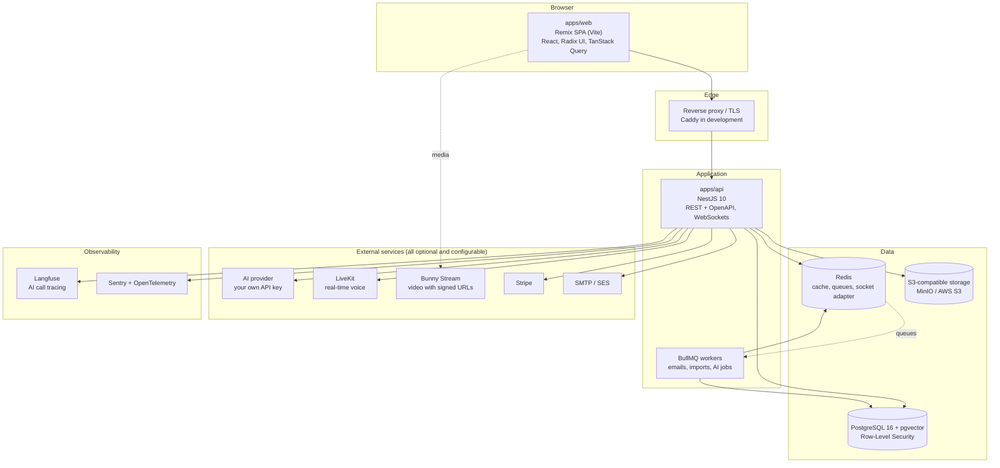

# Architecture

Mentingo is a pnpm + Turborepo monorepo with two applications and a set of shared packages. Everything is TypeScript.

## Components


```mermaid
flowchart TB
    subgraph client["Browser"]
        web["apps/web<br/>Remix SPA (Vite)<br/>React, Radix UI, TanStack Query"]
    end

    subgraph edge["Edge"]
        proxy["Reverse proxy / TLS<br/>Caddy in development"]
    end

    subgraph server["Application"]
        api["apps/api<br/>NestJS 10<br/>REST + OpenAPI, WebSockets"]
        worker["BullMQ workers<br/>emails, imports, AI jobs"]
    end

    subgraph data["Data"]
        pg[("PostgreSQL 16 + pgvector<br/>Row-Level Security")]
        redis[("Redis<br/>cache, queues, socket adapter")]
        s3[("S3-compatible storage<br/>MinIO / AWS S3")]
    end

    subgraph external["External services (all optional and configurable)"]
        llm["AI provider<br/>your own API key"]
        livekit["LiveKit<br/>real-time voice"]
        bunny["Bunny Stream<br/>video with signed URLs"]
        stripe["Stripe"]
        smtp["SMTP / SES"]
    end

    subgraph obs["Observability"]
        langfuse["Langfuse<br/>AI call tracing"]
        sentry["Sentry + OpenTelemetry"]
    end

    web --> proxy --> api
    api --> pg
    api --> redis
    api --> s3
    worker --> pg
    worker --> redis
    redis -.queues.-> worker
    api --> llm
    api --> livekit
    web -.media.-> bunny
    api --> stripe
    api --> smtp
    api --> langfuse
    api --> sentry
```

## Applications

| Path | What it is |
|---|---|
| `apps/api` | NestJS API. Domain logic, authentication, AI orchestration, background jobs (BullMQ), WebSockets (Socket.IO with a Redis adapter), OpenAPI schema at `/api`. |
| `apps/web` | Remix single-page application built with Vite. Learner, content-creator and admin interfaces. Talks to the API through a generated typed client. |
| `apps/reverse-proxy` | Caddy configuration providing per-tenant local domains and HTTPS in development. |

## Packages

| Package | What it is |
|---|---|
| `@repo/shared` | Types and helpers shared between API and web. |
| `@repo/prompts` | AI prompt sources, generated at build time. |
| `@repo/scorm-export-generator` | Node-side SCORM 1.2 export package generator. |
| `@repo/scorm-export-runtime` | Standalone browser runtime for exported SCORM packages. |
| `@repo/email-templates` | Transactional email templates (React Email). |
| `@mentingo/performance-tests` | k6 suite: load, stress, spike, soak and mixed scenarios. |
| `@repo/eslint-config`, `@repo/typescript-config` | Shared tooling configuration. |

## Multi-tenancy

Tenancy is enforced in the database, not only in application code.

- The application connects using a **least-privilege runtime role** (`LMS_DATABASE_URL`) for which PostgreSQL Row-Level Security policies are active. A bug in application code cannot read another tenant's rows through that connection.
- Migrations and seeds use a **separate administrative role** (`MIGRATOR_DATABASE_URL`) that is never used by the running application.
- Each tenant is served on its own origin. Allowed origins are configured explicitly (`CORS_ORIGIN`, `DEV_TENANT_ORIGINS`), and integration endpoints have their own narrower allow-list (`INTEGRATION_CORS_ORIGINS`).

## How the AI mentor works

1. Source material (documents, policies, existing courses) is uploaded and chunked; embeddings are stored in PostgreSQL using the `pgvector` extension - no separate vector database is required.
2. A conversation or generation request is assembled from versioned prompts in `@repo/prompts` plus retrieved context.
3. The request is sent to the AI provider **you** configured, using **your** API key, through the Vercel AI SDK.
4. Voice sessions run over LiveKit; text sessions over the API and WebSockets.
5. Every call is traced in Langfuse with prompt, latency and token cost, so AI behaviour is auditable after the fact.

## Background work

Long-running work - imports, exports, SCORM package generation, email delivery, AI jobs - runs on BullMQ queues backed by Redis, with concurrency controlled by `WORKER_CONCURRENCY`.

## Sizing and performance

The `@mentingo/performance-tests` package runs realistic concurrent-user scenarios against a deployment:

```bash
pnpm perf:load     # steady-state load
pnpm perf:stress   # find the breaking point
pnpm perf:spike    # sudden traffic surge
pnpm perf:soak     # sustained load over time
```

<!-- ETAP 3, decyzja 6: wstawić zmierzony footprint referencyjny (vCPU / RAM / storage / koszt miesięczny) dla np. 500 i 5000 aktywnych użytkowników. -->
