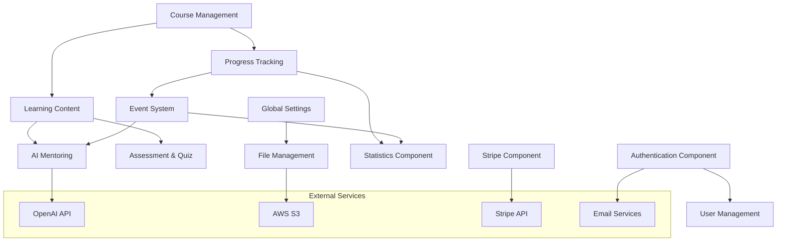

# Components

Based on the modular monolith structure and domain-driven design, here are the major components:

## Authentication & Authorization Component
**Location:** `apps/api/src/auth/`

**Responsibility:** Multi-strategy user authentication, JWT token management, OAuth integrations, and password lifecycle management

**Key Interfaces:**
- `POST /auth/login` - Local authentication endpoint
- `GET /auth/google` - Google OAuth initiation
- `GET /auth/microsoft` - Microsoft OAuth initiation
- `POST /auth/refresh` - JWT token refresh
- `POST /auth/reset-password` - Password reset workflow
- `POST /auth/create-password` - New password creation

**Dependencies:** users table, createTokens table, resetTokens table, JWT service, email service
**Technology Stack:** Passport.js strategies (Local, Google, Microsoft), @nestjs/jwt, bcryptjs for password hashing

## Course Management Component
**Location:** `apps/api/src/courses/`

**Responsibility:** Course creation, enrollment management, student-course relationships, and course lifecycle

**Key Interfaces:**
- `GET /courses` - Course listing with filtering
- `POST /courses` - Course creation (content creators/admins)
- `PUT /courses/:id` - Course updates
- `POST /courses/:id/enroll` - Student enrollment
- `GET /courses/:id/students` - Enrolled student management

**Dependencies:** courses table, studentCourses table, categories table, chapters component
**Technology Stack:** NestJS CRUD operations, Drizzle ORM queries, validation schemas

## Learning Content Component
**Location:** `apps/api/src/chapter/`, `apps/api/src/lesson/`

**Responsibility:** Hierarchical content structure (chapters → lessons), content sequencing, and learning material management

**Key Interfaces:**
- `GET /chapters` - Chapter listing for courses
- `POST /chapters` - Chapter creation
- `GET /lessons` - Lesson access and content delivery
- `POST /lessons` - Lesson creation and updates
- `PUT /lessons/:id/order` - Content sequencing

**Dependencies:** chapters table, lessons table, questions table, lesson progress tracking
**Technology Stack:** Repository pattern, admin vs student service separation, rich text content support

## Progress Tracking Component
**Location:** `apps/api/src/studentLessonProgress/`

**Responsibility:** Multi-granular learning progress (course/chapter/lesson), completion states, and performance analytics

**Key Interfaces:**
- `GET /progress/course/:id` - Course completion status
- `GET /progress/lesson/:id` - Lesson progress details
- `POST /progress/lesson/:id/complete` - Progress updates
- `GET /progress/statistics` - Individual performance metrics

**Dependencies:** studentLessonProgress table, studentChapterProgress table, studentCourses table, events system
**Technology Stack:** Event-driven progress updates, statistics aggregation, CQRS pattern for read/write separation

## AI Mentoring Component
**Location:** `apps/api/src/ai/`

**Responsibility:** Personalized AI tutoring, conversation management, learning assistance, and intelligent progress guidance

**Key Interfaces:**
- `POST /ai/chat` - AI conversation interactions
- `GET /ai/threads` - Conversation history
- `POST /ai/threads/:id/messages` - Message management
- `GET /ai/lesson-insights` - AI-powered learning recommendations

**Dependencies:** aiMentorThreads table, aiMentorThreadMessages table, OpenAI API, lesson content
**Technology Stack:** OpenAI SDK 5.8.2, AI SDK 4.3.17, token management (tiktoken), conversation threading

## Assessment & Quiz Component
**Location:** `apps/api/src/questions/`

**Responsibility:** Quiz creation, question management, answer validation, and assessment scoring

**Key Interfaces:**
- `GET /questions/lesson/:id` - Question retrieval for lessons
- `POST /quiz/attempt` - Quiz submission and scoring
- `GET /quiz/attempts` - Attempt history and results
- `POST /questions` - Question creation (content creators)

**Dependencies:** questions table, questionAnswerOptions table, quizAttempts table, studentQuestionAnswers table
**Technology Stack:** Complex validation logic, multiple question types, scoring algorithms

## File & Media Management Component
**Location:** `apps/api/src/file/`, `apps/api/src/s3/`

**Responsibility:** File uploads, SCORM package handling, media storage, and content delivery

**Key Interfaces:**
- `POST /files/upload` - General file upload
- `POST /scorm/upload` - SCORM package processing
- `GET /files/:id` - File access with permissions
- `DELETE /files/:id` - File cleanup

**Dependencies:** AWS S3, scormFiles table, scormMetadata table, file validation guards
**Technology Stack:** AWS SDK, MIME type validation, file processing pipelines

## Global Settings Component
**Location:** `apps/api/src/settings/`

**Responsibility:** Multi-tenant configuration, platform branding, company information, and system-wide settings

**Key Interfaces:**
- `GET /settings` - Current platform configuration
- `PUT /settings` - Settings updates (admin only)
- `GET /settings/company` - Company branding information
- `PUT /settings/logo` - Platform logo management

**Dependencies:** settings table, S3 for logo storage, role-based access control
**Technology Stack:** Multi-tenant architecture, settings validation, audit logging

## Component Interaction Diagram

