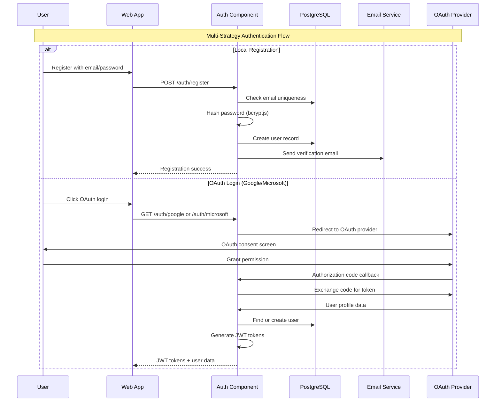
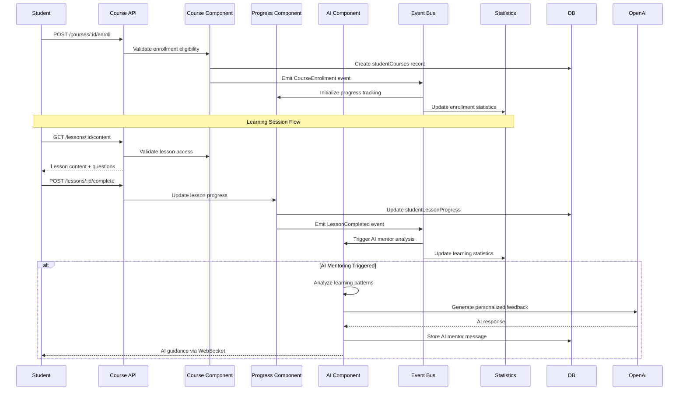
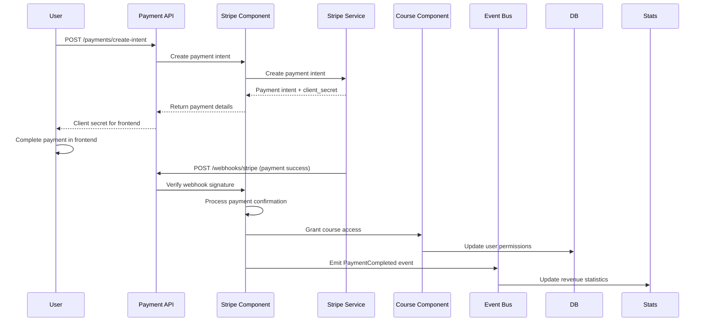
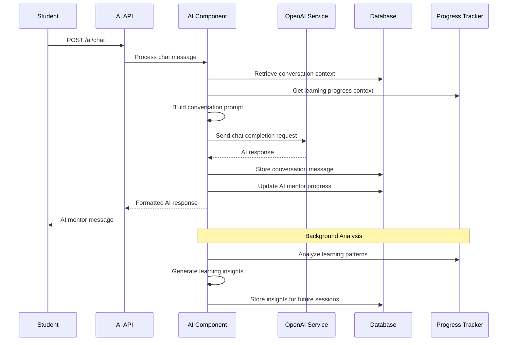

# Core Workflows

Based on the backend architecture, here are the key workflows that illustrate component interactions and system behavior:

## User Authentication & Registration Workflow

## Course Enrollment & Learning Progress Workflow

## Payment Processing Workflow

## AI Mentoring Conversation Workflow

