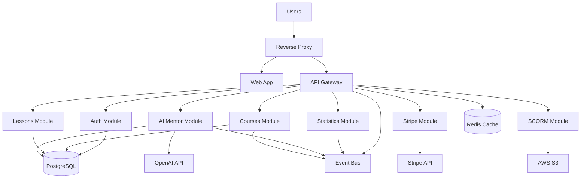

# High Level Architecture

## Technical Summary

Mentingo LMS employs a **modular monolithic architecture** built on NestJS, designed to provide scalable learning management capabilities while maintaining developer productivity. The system follows **domain-driven design principles** with clear module boundaries (auth, courses, lessons, AI mentoring, payments) that allow new developers to understand and contribute to specific business areas without needing to comprehend the entire system. The architecture leverages **PostgreSQL with Drizzle ORM** for robust data persistence, **multi-strategy authentication** for flexible user access, and **integrated AI capabilities** through OpenAI for enhanced learning experiences. Key patterns include **CQRS for complex workflows**, **repository pattern for data access**, and **comprehensive event-driven communication** between modules, all designed to ensure that new developers can quickly locate, understand, and safely modify functionality within their assigned domain areas.

## High Level Overview

**Architecture Style**: **Modular Monolith** - Provides the simplicity of single deployment while maintaining clear domain boundaries
- **Repository Structure**: **Monorepo** with Turbo build orchestration (apps/api, apps/web, apps/reverse-proxy)
- **Service Architecture**: **Single backend service** with clear internal module separation for different business domains
- **Data Flow**: Request → Authentication → Module Router → Business Logic → Repository → Database, with event emission for cross-cutting concerns
- **Key Architectural Decisions**:
  - **Domain-Driven Modules**: Each business area (courses, lessons, auth, AI, payments) is self-contained
  - **Event-Driven Communication**: Modules communicate through events rather than direct imports
  - **Multi-Tenant Support**: Global settings with tenant-specific configurations
  - **AI-First Learning**: OpenAI integration as a core architectural component, not an add-on

## High Level Project Diagram

## Architectural and Design Patterns

**Key patterns that guide the Mentingo architecture:**

- **Domain-Driven Design (DDD)**: Each module represents a bounded context (auth, courses, lessons, AI mentoring) - *Rationale:* Enables new developers to focus on specific business domains without understanding the entire system
- **Repository Pattern**: Data access abstraction through repositories and Drizzle ORM - *Rationale:* Provides testable, swappable data access and clear separation between business logic and persistence
- **Command Query Responsibility Segregation (CQRS)**: Separate read/write operations for complex workflows - *Rationale:* Simplifies complex business operations like course enrollment and lesson progression tracking
- **Event-Driven Architecture**: Modules communicate through events for loose coupling - *Rationale:* Allows statistics, AI, and notification features to react to business events without tight coupling
- **Strategy Pattern**: Multiple authentication strategies (local, Google, Microsoft OAuth) - *Rationale:* Flexible authentication options for different user types and organizational requirements
- **Factory Pattern**: Email adapter factory for different environments (SMTP, SES, local) - *Rationale:* Environment-specific implementations without code changes
- **Decorator Pattern**: NestJS guards and interceptors for cross-cutting concerns - *Rationale:* Clean separation of security, logging, and validation concerns
