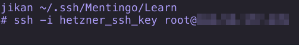
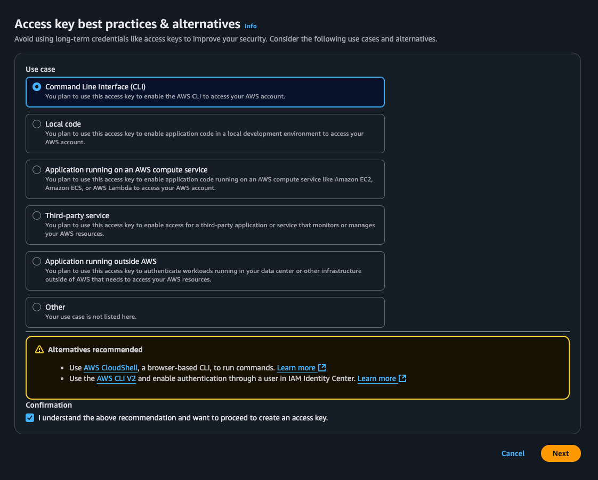
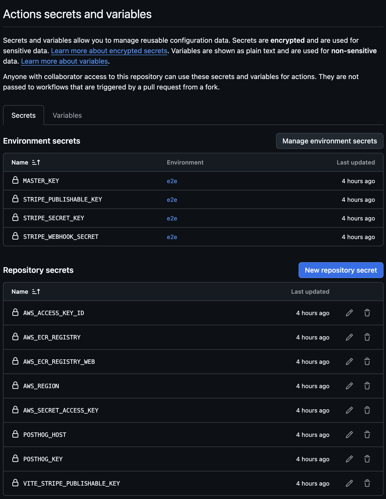
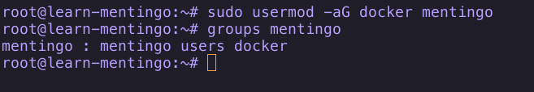

This guide provides a complete walkthrough for deploying the Mentingo application. The infrastructure will be hosted on Hetzner Cloud, while AWS will be used for DNS, container image storage (ECR), and user management (IAM).

---

### **Part 1: Hetzner Infrastructure Setup** ⚙️

#### **1.1 Project & Firewall**

1.  In the Hetzner Cloud Console, create a new **Project**.

    

2.  Navigate to **Security -\> Firewalls** within your new project.

3.  Create a new firewall. Add an **inbound rule** to allow traffic on **port 22 (SSH)**. For enhanced security, restrict the **Source IPs** to your public IP address.

    

4.  For **outbound rules**, allow all **IPv4** traffic to any destination.

#### **1.2 Object Storage (S3 Bucket)**

1.  In the Hetzner Console, navigate to **Storage -\> Object Storage** and create a new **bucket**. This will be used for file uploads.

    

2.  After the bucket is created, generate **credentials** (access key and secret key) for it.

    

3.  🔐 **Important:** Securely save these credentials. You will need them for the application's environment variables later.

#### **1.3 Server Creation & SSH**

1.  Navigate to **Servers** and click **Add server**.

2.  Select your desired server **location**.

3.  Choose the **Ubuntu** image (e.g., 22.04). A server with **4 vCPU** and **8 GB of RAM** is recommended.

    

4.  In the **Networking** section, ensure **Public IPv4** is enabled.

5.  In the **SSH keys** section, generate a new key on your local machine if you don't have one already. Replace `<client-name>` with an appropriate identifier.

    ```bash
    ssh-keygen -t ed25519 -o -a 100 -C "<client-name>"
    ```

6.  Copy the content of your **public key** (e.g., `~/.ssh/id_ed25519.pub`) and add it to the configuration.

7.  🔐 **Important:** Store your private key safely\!

8.  Before creating the server, under **Firewall**, select the firewall you created in step 1.1.

9.  Enable **Backups**.

    

#### **1.4 Networking (Floating IP)**

1.  Once the server is running, navigate to **Networking -\> Floating IPs** and assign a new **Floating IP** to your server. This provides a static IP that can be re-assigned if you ever need to replace the server.

    

2.  To make the floating IP persistent on the server, first connect to the server using its **public IP** (not the floating IP yet) and your SSH key.

    

3.  Once logged in, follow the official Hetzner documentation to [create a persistent configuration file for the floating IP](https://docs.hetzner.com/cloud/floating-ips/persistent-configuration/).

    

    

4.  Apply the new network configuration with the command:

    ```bash
    sudo netplan apply
    ```

5.  You can now disconnect and reconnect to the server using the new **Floating IP**.

---

### **Part 2: AWS Foundation Setup** ☁️

#### **2.1 DNS Configuration (Route 53)**

1.  In the AWS Console, go to **Route 53** and create a new **Hosted zone** for your client's domain.

2.  Route 53 will provide a set of Name Server (NS) records. These must be added to the client's domain registrar's DNS settings.

    > **Alternative:** If you cannot delegate NS records to AWS, create an A record in your own DNS provider that points to the Hetzner server's floating IP.

3.  Once the NS records have propagated, create an **A Record** in your new hosted zone. Point it to the **Floating IP** of your Hetzner server.

    

    

    

#### **2.2 Container Registry (ECR)**

1.  In the AWS Console, go to **Elastic Container Registry (ECR)**.
2.  Create two new **private** repositories. Replace `<client>` with the actual client's name.
    - `tenant/<client>/api`
    - `tenant/<client>/ui`

      

#### **2.3 IAM Policies & Users**

1.  Navigate to **IAM** in the AWS Console.

2.  Create two IAM policies.

    > 🚨 **Note:** In the JSON below, replace `<client>` with the client's name and `123456789012` with your **AWS Account ID**.

    **Policy 1: `tenant-client-ci`** (Allows pushing images to ECR)

    ```json
    {
      "Version": "2012-10-17",
      "Statement": [
        {
          "Sid": "AllowEcrAuth",
          "Effect": "Allow",
          "Action": "ecr:GetAuthorizationToken",
          "Resource": "*"
        },
        {
          "Sid": "AllowReadAccessToRepos",
          "Effect": "Allow",
          "Action": ["ecr:ListImages", "ecr:GetDownloadUrlForLayer", "ecr:BatchGetImage"],
          "Resource": [
            "arn:aws:ecr:eu-central-1:123456789012:repository/tenant/<client>/api",
            "arn:aws:ecr:eu-central-1:123456789012:repository/tenant/<client>/ui"
          ]
        },
        {
          "Sid": "AllowWriteAccessToApiRepo",
          "Effect": "Allow",
          "Action": [
            "ecr:UploadLayerPart",
            "ecr:PutImage",
            "ecr:InitiateLayerUpload",
            "ecr:CompleteLayerUpload",
            "ecr:BatchCheckLayerAvailability"
          ],
          "Resource": "arn:aws:ecr:eu-central-1:123456789012:repository/tenant/<client>/api"
        },
        {
          "Sid": "AllowWriteAccessToUiRepo",
          "Effect": "Allow",
          "Action": [
            "ecr:UploadLayerPart",
            "ecr:PutImage",
            "ecr:InitiateLayerUpload",
            "ecr:CompleteLayerUpload",
            "ecr:BatchCheckLayerAvailability"
          ],
          "Resource": "arn:aws:ecr:eu-central-1:123456789012:repository/tenant/<client>/ui"
        }
      ]
    }
    ```

    **Policy 2: `tenant-client-docker`** (Allows pulling images from ECR)

    ```json
    {
      "Version": "2012-10-17",
      "Statement": [
        {
          "Sid": "AllowEcrAuth",
          "Effect": "Allow",
          "Action": "ecr:GetAuthorizationToken",
          "Resource": "*"
        },
        {
          "Sid": "AllowReadAccessToRepos",
          "Effect": "Allow",
          "Action": ["ecr:ListImages", "ecr:GetDownloadUrlForLayer", "ecr:BatchGetImage"],
          "Resource": [
            "arn:aws:ecr:eu-central-1:123456789012:repository/tenant/<client>/api",
            "arn:aws:ecr:eu-central-1:123456789012:repository/tenant/<client>/ui"
          ]
        }
      ]
    }
    ```

3.  Now, create two IAM users.

    **User 1: `tenant-<client>-ci`**
    - Create a user with this name.

      

    - Attach the `tenant-client-ci` policy you just created.

      

    - Go to the user's **Security credentials** tab and create an **Access key**.

      

    - Select **Command Line Interface (CLI)** as the use case.

      

    - 🔐 **Important:** Save the generated Access Key ID and Secret Access Key. You will use these as GitHub Actions secrets.

      

    **User 2: `tenant-<client>-docker`**
    - Repeat the process to create this second user.
    - Attach the `tenant-client-docker` policy.
    - Generate and save the access keys for this user as well. You will use these on the Hetzner server.

---

### **Part 3: GitHub & CI/CD Configuration** 👨‍💻

#### **3.1 Repository Setup**

1.  Init a new GitHub repository as a single commit containing the copy of `https://github.com/Selleo/mentingo`
2.  Single commit is preffered to clearly seperate IP boundry between open source and custom changes and simplifies appling patches in the future.

    

#### **3.2 Repository Secrets**

1.  In your GitHub repository, go to **Settings -\> Secrets and variables -\> Actions**.

2.  Add the following secrets using the credentials from your `tenant-<client>-ci` IAM user and the ECR repository URIs.
    - `AWS_ACCESS_KEY_ID`: Access key ID for the CI user.
    - `AWS_SECRET_ACCESS_KEY`: Secret access key for the CI user.
    - `AWS_REGION`: e.g., `eu-central-1`.
    - `AWS_ECR_REGISTRY`: The full URI for the `tenant/<client>/api` ECR repository.
    - `AWS_ECR_REGISTRY_WEB`: The full URI for the `tenant/<client>/ui` ECR repository.
    - (Add other secrets like `VITE_STRIPE_PUBLISHABLE_KEY`, `POSTHOG_KEY`, `POSTHOG_HOST` and Sentry keys as needed).

3.  If you want your E2E tests to work, create environment called `e2e` and then add these secrets:
    - `MASTER_KEY`: 32 byte base64 (can be generated using `openssl rand -base64 32`)
    - `STRIPE_PUBLISHABLE_KEY`
    - `STRIPE_SECRET_KEY`
    - `STRIPE_WEBHOOK_SECRET`

    > **Note:** You can use Stripe API keys from your Stripe test mode (sandbox) - these are safe to use for development and CI environments.

    

#### **3.3 GitHub Actions Workflows**

1.  In your repository, create a `.github/workflows/` directory.

2.  Create the two deployment files below inside that directory.

    **File 1: `deploy-api.yml`**

    ```yaml
    name: Deploy API
    env:
      HUSKY: 0
    on:
      push:
        branches:
          - "main"
    jobs:
      build-api:
        runs-on: ubuntu-latest
        steps:
          - uses: actions/checkout@v4
            with:
              fetch-depth: 0
              fetch-tags: true

          - name: Save version in apps/api
            run: |
              # Try to get latest local tag
              TAG_VERSION=$(git describe --tags --abbrev=0 --match "v*" 2>/dev/null || true)

              # If no tag found, fetch from external repo
              if [ -z "$TAG_VERSION" ]; then
                echo "⚠️ No local tags found. Fetching from Selleo/mentingo..."
                TAG_VERSION=$(git ls-remote --tags https://github.com/Selleo/mentingo \
                  | awk -F/ '{print $3}' \
                  | sed 's/\^{}//' \
                  | grep '^v' \
                  | sort -V \
                  | tail -n1)
              fi

              echo "{ \"version\": \"$TAG_VERSION\" }" > apps/api/version.json
              echo "✅ Wrote version $TAG_VERSION to apps/api/version.json"
          - name: Configure AWS credentials
            uses: aws-actions/configure-aws-credentials@v1-node16
            with:
              aws-access-key-id: ${{ secrets.AWS_ACCESS_KEY_ID }}
              aws-secret-access-key: ${{ secrets.AWS_SECRET_ACCESS_KEY }}
              aws-region: ${{ secrets.AWS_REGION }}
          - name: Login to Amazon ECR
            id: login-ecr
            uses: aws-actions/amazon-ecr-login@v1
          - name: Build, tag, and push image to Amazon ECR
            env:
              ECR_REGISTRY: ${{ secrets.AWS_ECR_REGISTRY }}
              IMAGE_TAG: ${{ github.sha }}
            run: |
              docker build -f ./api.Dockerfile --build-arg VERSION=$IMAGE_TAG -t $ECR_REGISTRY:$IMAGE_TAG .
              docker tag $ECR_REGISTRY:$IMAGE_TAG $ECR_REGISTRY:latest
              docker push $ECR_REGISTRY:$IMAGE_TAG
              docker push $ECR_REGISTRY:latest
    ```

    **File 2: `deploy-ui.yml`**

    ```yaml
    name: Deploy WEBAPP
    env:
      HUSKY: 0
    on:
      push:
        branches:
          - "main"
    jobs:
      build-web:
        runs-on: ubuntu-latest
        steps:
          - uses: actions/checkout@v4
            with:
              fetch-depth: 0
              fetch-tags: true

          - name: Save version in apps/web
            run: |
              # Try to get latest local tag
              TAG_VERSION=$(git describe --tags --abbrev=0 --match "v*" 2>/dev/null || true)

              # If no tag found, fetch from external repo
              if [ -z "$TAG_VERSION" ]; then
                echo "⚠️ No local tags found. Fetching from Selleo/mentingo..."
                TAG_VERSION=$(git ls-remote --tags https://github.com/Selleo/mentingo \
                  | awk -F/ '{print $3}' \
                  | sed 's/\^{}//' \
                  | grep '^v' \
                  | sort -V \
                  | tail -n1)
              fi

              echo "{ \"version\": \"$TAG_VERSION\" }" > apps/web/version.json
              echo "✅ Wrote version $TAG_VERSION to apps/web/version.json"
          - name: Configure AWS credentials
            uses: aws-actions/configure-aws-credentials@v1-node16
            with:
              aws-access-key-id: ${{ secrets.AWS_ACCESS_KEY_ID }}
              aws-secret-access-key: ${{ secrets.AWS_SECRET_ACCESS_KEY }}
              aws-region: ${{ secrets.AWS_REGION }}
          - name: Login to Amazon ECR
            id: login-ecr
            uses: aws-actions/amazon-ecr-login@v1
          - name: Build, tag, and push image to Amazon ECR
            env:
              ECR_REGISTRY: ${{ secrets.AWS_ECR_REGISTRY_WEB }}
              IMAGE_TAG: ${{ github.sha }}
              VITE_STRIPE_PUBLISHABLE_KEY: ${{secrets.VITE_STRIPE_PUBLISHABLE_KEY}}
              VITE_SENTRY_DSN: ${{secrets.SENTRY_DSN}}
              VITE_POSTHOG_KEY: ${{ secrets.POSTHOG_KEY }}
              VITE_POSTHOG_HOST: ${{ secrets.POSTHOG_HOST }}
            run: |
              docker build -f ./web.Dockerfile \
                --build-arg VERSION=$IMAGE_TAG \
                --build-arg VITE_STRIPE_PUBLISHABLE_KEY=$VITE_STRIPE_PUBLISHABLE_KEY \
                --build-arg VITE_SENTRY_DSN=$VITE_SENTRY_DSN \
                --build-arg VITE_POSTHOG_KEY=$VITE_POSTHOG_KEY \
                --build-arg VITE_POSTHOG_HOST=$VITE_POSTHOG_HOST \
                -t $ECR_REGISTRY:$IMAGE_TAG .
              docker tag $ECR_REGISTRY:$IMAGE_TAG $ECR_REGISTRY:latest
              docker push $ECR_REGISTRY:$IMAGE_TAG
              docker push $ECR_REGISTRY:latest
    ```

3.  Push your code changes. The GitHub Actions should run automatically and push your first images to ECR.

---

### **Part 4: Final Deployment & Server Configuration** 🚀

#### **4.1 Initial Server Software Installation**

1.  SSH into your Hetzner server.
2.  Save the following installation script as `install_packages.sh`.

    ```sh
    #!/bin/sh
    set -e

    # Update and install prerequisite packages
    apt update && \
      apt -y install wget gpg coreutils jq ca-certificates curl gnupg debian-keyring debian-archive-keyring apt-transport-https

    # Add Docker repository
    install -m 0755 -d /etc/apt/keyrings
    curl -fsSL https://download.docker.com/linux/ubuntu/gpg | gpg --dearmor -o /etc/apt/keyrings/docker.gpg
    chmod a+r /etc/apt/keyrings/docker.gpg

    echo \
      "deb [arch="$(dpkg --print-architecture)" signed-by=/etc/apt/keyrings/docker.gpg] https://download.docker.com/linux/ubuntu \
      "$(. /etc/os-release && echo "$VERSION_CODENAME")" stable" | \
       tee /etc/apt/sources.list.d/docker.list > /dev/null

    # Add Caddy repository
    curl -1sLf 'https://dl.cloudsmith.io/public/caddy/stable/gpg.key' | gpg --dearmor -o /usr/share/keyrings/caddy-stable-archive-keyring.gpg
    curl -1sLf 'https://dl.cloudsmith.io/public/caddy/stable/debian.deb.txt' | tee /etc/apt/sources.list.d/caddy-stable.list

    # Install main packages
    apt update && apt -y install docker-ce docker-ce-cli containerd.io docker-buildx-plugin docker-compose-plugin caddy

    # Add helpful bash aliases
    cat <<EOF >> /root/.bash_aliases
    alias sc=systemctl
    alias jc=journalctl
    EOF

    echo "Installation complete."
    ```

3.  Run the script:
    ```bash
    chmod +x install_packages.sh
    ./install_packages.sh
    ```
4.  You may need to start a new shell session (`exec bash`) for the aliases to take effect.

#### **4.2 Configure Docker for AWS ECR**

1.  Install the ECR credential helper (see full instructions [here](https://github.com/awslabs/amazon-ecr-credential-helper)).

    ```bash
    sudo apt install amazon-ecr-credential-helper
    ```

2.  Create mentingo user, add it to group docker and switch to it

    ```bash
    sudo add user mentingo
    ```

    

    ```bash
    sudo user mod -aG docker mentingo
    ```

    

    ```bash
    su mentingo
    ```

3.  Create the AWS config directory:

    ```bash
    mkdir -p ~/.aws
    ```

    

4.  Create a credentials file at `~/.aws/credentials`.

    ```ini
    [default]
    aws_access_key_id = <ACCESS_KEY_FOR_TENANT_CLIENT_DOCKER_USER>
    aws_secret_access_key = <SECRET_KEY_FOR_TENANT_CLIENT_DOCKER_USER>
    ```

    

5.  Configure Docker to use the ECR helper by editing `~/.docker/config.json`.

    ```json
    {
      "credsStore": "ecr-login"
    }
    ```

    

#### **4.3 Pull & Tag Docker Images**

1.  You can now pull images directly from ECR.

    ```bash
    docker pull <ecr_uri_for_api>:latest
    docker pull <ecr_uri_for_ui>:latest
    ```

    

2.  List your images to see them locally.
    ```bash
    docker images
    ```
3.  Tag the images with simpler names for easier use in `docker-compose.yml`.

    ```bash
    docker tag <ecr_uri_for_api>:latest app:latest
    docker tag <ecr_uri_for_ui>:latest ui:latest
    ```

    

#### **4.4 Configure Docker Compose**

1.  Create a new directory for your application (e.g., `/opt/mentingo`) and `cd` into it.

2.  Create a `docker-compose.yml` file with the following content:

    ```yaml
    services:
      app:
        image: app:latest
        container_name: app
        restart: unless-stopped
        env_file: .env.prd.api
        command: server
        ports:
          - "3000:3000"
        volumes:
          - /home/app/uploads:/app/apps/api/uploads
        depends_on:
          - db

      db:
        image: pgvector/pgvector:pg16
        container_name: db
        restart: unless-stopped
        environment:
          POSTGRES_PASSWORD: guidebook # Change this password
          POSTGRES_DB: guidebook
        volumes:
          - lms-db-data:/var/lib/postgresql/data
        ports:
          - "5434:5432"

      frontend:
        image: ui:latest
        container_name: frontend
        restart: unless-stopped
        env_file: .env.prd.ui
        ports:
          - "3080:8080"

      redis:
        image: "redis:latest"
        container_name: redis
        restart: unless-stopped
        ports:
          - "6379:6379"
        volumes:
          - "lms-redis-data:/data"

    volumes:
      lms-db-data:
        driver: local
      lms-redis-data:
        driver: local
    ```

3.  Create two environment files.

    **File 1: `.env.prd.api`**

    ```env
    # GENERAL
    CORS_ORIGIN="https://<client-domain>"
    EMAIL_ADAPTER="smtp"
    DEBUG=false
    PASSWORD=<default_password_for_seeded_accounts>

    # DATABASE
    DATABASE_URL="postgres://postgres:guidebook@db:5432/guidebook" # Use the password from docker-compose

    # REDIS
    REDIS_URL="redis://redis:6379"

    # JWT
    JWT_SECRET="<generate_a_strong_random_secret>"
    JWT_REFRESH_SECRET="<generate_another_strong_random_secret>"
    JWT_EXPIRATION_TIME="15m"

    # MAILS (Example for AWS SES)
    SMTP_HOST="email-smtp.eu-central-1.amazonaws.com"
    SMTP_PORT="2465"
    SMTP_USER="<smtp_user_access_key>"
    SMTP_PASSWORD="<smtp_user_secret_key>"
    SMTP_EMAIL_FROM="noreply@<client-domain>"

    # S3 (Hetzner Object Storage)
    S3_ENDPOINT="https://<region>.your-objectstorage.com" # e.g., fsn1
    S3_REGION="<region>" # e.g., fsn1
    S3_ACCESS_KEY_ID="<hetzner_storage_access_key>"
    S3_SECRET_ACCESS_KEY="<hetzner_storage_secret_key>"
    S3_BUCKET_NAME="<bucket-name>"

    # STRIPE & SENTRY
    STRIPE_SECRET_KEY=
    STRIPE_PUBLISHABLE_KEY=
    STRIPE_WEBHOOK_SECRET=
    SENTRY_ENVIRONMENT=production
    SENTRY_DSN=

    # 32 byte base64 key (can be generate using openssl rand -base64 32)
    MASTER_KEY=
    ```

    **File 2: `.env.prd.ui`**

    ```env
    VITE_API_URL='https://<client-domain>/api'
    VITE_APP_URL='https://<client-domain>'

    # STRIPE & SENTRY
    VITE_STRIPE_PUBLISHABLE_KEY=
    SENTRY_AUTH_TOKEN=
    SENTRY_ORG=
    SENTRY_PROJECT=
    VITE_SENTRY_DSN=
    ```

#### **4.5 Run Application Containers**

1.  Start the containers in detached mode.
    ```bash
    docker compose up -d
    ```
2.  Check that all containers are running.
    ```bash
    docker ps
    ```

#### **4.6 Database Initialization**

1.  Connect to the running API container.
    ```bash
    docker exec -it app sh
    ```
2.  Inside the container, run the database migrations and seed the data.
    ```sh
    # Inside the 'app' container
    npm run db:migrate
    npm run db:seed-prod
    ```
3.  Type `exit` to leave the container shell.

#### **4.7 Configure Caddy Reverse Proxy**

1.  Edit the Caddy configuration file.
    ```bash
    vim /etc/caddy/Caddyfile
    ```
2.  Replace the entire file content with the following, updating `<client-domain.com>` with your actual domain. Caddy will automatically handle HTTPS.

    ```caddy
    <client-domain.com> {
        # API traffic
        @api path /api/*
        handle @api {
            reverse_proxy http://localhost:3000
        }

        # All other traffic goes to the frontend
        handle {
            reverse_proxy http://localhost:3080
        }
    }
    ```

    If you're having issues with saving the file try to do it as root user.

#### **4.8 Final Firewall Rules**

1.  Go back to the Hetzner Cloud firewall settings.
2.  Add two new **inbound** rules to allow public web traffic:
    - Port `80` (HTTP) from any IPv4 source.
    - Port `443` (HTTPS) from any IPv4 source.

      

3.  Back in the server's console, reload Caddy to apply the new configuration.
    ```bash
    systemctl reload caddy
    ```

---

### **Deployment Complete\!** 🎉

Your Mentingo instance should now be live and accessible at your domain.
